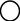

- [2.1 Khu vườn có lối đi phân nhánh](#a1)
- [2.2 Xây dựng mô hình](#a2)
- [2.3 Các thành phần của mô hình](#a3)
- [2.4 Luyện mô hình](#a4)
- [2.5 Tổng kết](#a5)

<details class='imp'><summary>import lib cần thiết</summary>
import arviz as az
import matplotlib.pyplot as plt
from jax import random
import jax.numpy as jnp
import numpyro
import numpyro.distributions as dist
from numpyro.infer import SVI, Trace_ELBO
from numpyro.infer.autoguide import AutoLaplaceApproximation
import numpyro.optim as optim
az.style.use("fivethirtyeight")</details>

Cristoforo Colombo (Christopher Columbus) cho thuyền ra khơi và đi theo hướng Tây vào năm 1492, lúc ấy ông nghĩ rằng Trái Đất hình cầu. Thời đó, ông cũng giống như những người có học vấn khác. Nhưng ông khác những người ấy ở chỗ nghĩ rằng Trái đất nhỏ hơn nhiều so với thực tế -  chu vi đường xích đạo chỉ bằng 30.000 km trong khi thực tế là 40.000 km. ([**HÌNH 2.1**](#f1))<sup><a name="r37" href="#37">37</a></sup> Đây là một sai lầm nghiêm trọng nhất của lịch sử Châu Âu. Nếu Colombo tính được Trái Đất có chu vi xích đạo là 40.000 thì đoàn thuyền của ông đã mang đủ thức ăn và nước uống để hoàn thành cuộc du hành về hướng tây đến Châu Á. Nhưng với 30.000 km, Châu Á sẽ cách gần bờ Tây của California, và thuyền của ông vẫn có thể mang đủ lương thực khi tới đó. Với niềm tin vào phán đoán sai sót của mình, Colombo bắt đầu cuộc hành trình, và cuối cùng đặt chân đến vùng đất Bahamas.

Colombo đã ước lượng khoảng cách dựa trên quan điểm thế giới nhỏ. Nhưng ông lại sống trong thế giới lớn, nên ước lượng bị sai. Tuy nhiên, ông cũng may. Mô hình thế giới nhỏ của ông đã sai một cách ngớ ngẩn: Đó là có rất nhiều đất liền trên khoảng cách ấy. Nếu mô hình của ông sai theo như mong đợi: không có gì ngoài biến giữa Châu Âu và Châu Á, ông và đoàn thuyền đã phải hết lương thực từ lâu trước khi đến được Đông Ấn.

Mô hình thế giới nhỏ và thế giới lớn của Colombo cho thấy một bức tranh giữa mô hình và hiện thực. Tất cả mọi mô hình thống kê đều có hai mặt: thế giới nhỏ mà mô hình được cài đặt và thế giới lớn mà chúng ta muốn áp dùng mô hình lên.<sup><a name="r38" href="#38">38</a></sup> Tương tác giữa hai thế giới vẫn còn là một thách thức lớn của các mô hình khoa học. Thách thức này còn nghiêm trọng hơn khi ta quên mất sự phân biệt này.

**THẾ GIỚI NHỎ** là một thế giới logic tự giới hạn của mô hình. Trong đó, mọi khả năng đều được biết trước. Không có sự bất ngờ, nhưng sự xuất hiện của một đại lục giữa Châu Âu và Châu Á. Trong thế giới nhỏ, ta cần phải xác định được logic của nó, khẳng định nó hoạt động như mong đợi dưới giả định cho trước. Mô hình Bayes tốt hơn trong trường hợp này, vì nó dùng những xác suất để tối ưu hoá: Không một mô hình nào khác sử dụng dữ liệu tốt hơn và hỗ trợ dự đoán chính xác hơn, giả định rằng thế giới nhỏ là mô tả chính xác của thế giới lớn.<sup><a name="r39" href="#39">39</a></sup>

**THẾ GIỚI LỚN** là phạm vi mà mô hình thống kê áp dụng trên đó. Trong thế giới lớn, có thể có những sự kiện không được lồng ghép vào thế giới nhỏ. Có thể nói là, mô hình là một thế giới lớn bị thu nhỏ không hoàn toàn, và nó có sai sót, ngay cả khi mọi biến cố đều đã được lồng ghép vào. Sự kiên định trong logic của mô hình thế giới nhỏ không bao giờ chắc chắn đúng và tối ưu nhất trong thế giới lớn. Nhưng nó là một cánh cửa vào thế giới lớn.

<a name="f1"></a>
<details class="fig"><summary>Hình 2.1: Hình vẽ địa cầu 1492 của Martin Behaim, được Colombo dùng. Châu Âu nằm ở bên phải. Châu Á ở bên trái. Hòn đảo lớn tên "Cipangu" là Nhất Bản.</summary></details>

Trong chương này, bạn sẽ học cách xây dựng mô hình Bayes. Cách mà mô hình Bayes học từ các bằng chứng là cách tối ưu nhất trong thế giới nhỏ. Khi giả chúng của chúng gần giống với thực tại, chúng sẽ hoạt động rất tốt trong thế giới lớn. Nhưng hiệu năng trong thế giới lớn phải được kiểm chứng hơn là dựa vào logic. Đi qua lại giữa hai thế giới này cho phép những phương pháp khoa học chính thống, như suy luận Bayes, và những phương pháp khoa học phi chính thống, như đánh giá hội đồng, đóng vai trò không thể thiếu được.

Chương này tập trung vào thế giới nhỏ. Nó giải thích thuyết xác suất dưới dạng thiết thực: đếm số cách có thể xảy ra. Suy luận Bayes xuất phát tự nhiên từ góc nhìn xác suất này. Sau đó chương này sẽ trình bày các thành phần của mô hình thống kê Bayes, để học được từ dữ liệu (data). Và nó sẽ cho bạn thấy làm sao để cho mô hình sống dậy, và tạo ước lượng.

Tất cả công việc này cho ta một kiến thức nền tảng cho chương sau, ở đó bạn học cách tóm tắt ước lượng Bayes, cũng như bắt đầu xem xét đến nghĩa vụ của nó trong thế giới lớn.

<div class="alert alert-info">
    <p><strong>Thế giới lớn luôn nhanh và hiệu quả.</strong> Thế giới tự nhiên rất phức tạp, và khoa học là những lời nhắc nhở đó. Mọi thứ từ con bọ, con sóc hay con đười ươi luôn cố gắng thay đổi và thích nghi với bên ngoài. Chắc chắn động vật không phải Bayes, bởi vì Bayes rất tốn kém và cần phải chọn được một mô hình tốt. Thay vào đó, động vật sử dụng những phương pháp tự học hỏi những kỹ năng mới để sinh tồn được trong môi trường của chúng, ở quá khứ và hiện tại. Những kỹ năng này sử dụng những con đường tắt giúp chúng thích nghi tốt hơn, và chắc chắn hiệu quả cao hơn với những phân tích Bayes rườm rà-  chưa kể chi phí cho thu thập thông tin, xử lý kết quả (và overfitting, Chương 7).<sup><a name="r40" href="#40">40</a></sup> Khi bạn phân loại được thông tin nào cần quan tâm hay bỏ qua, việc dùng Bayes là hoàn toàn lãng phí. Bayes không phải điều kiện cần hoặc đủ để ra một quyết định đúng đắn, như các loài động vật đã chứng minh. Nhưng với con người, phân tích Bayes là một phương pháp tổng quát để khám phá và xử lý những thông tin từ dữ liệu một cách logic. Nhưng đừng nghĩ nó là phương pháp duy nhất.</p>
</div>

## <center>2.1 Khu vườn có lối đi phân nhánh</center><a name="a1"></a>

Phần này ta sẽ xây dựng suy luận bayes từ trạng thái cơ bản nhất, cho nên không có gì phù phiếm về nó. Suy luận Bayes chẳng qua là đếm và so sánh các khả năng. Ta có thể ẩn dụ bằng một câu chuyện tương tự, chuyện ngắn của Jorge Luis Borges "Khu vườn có những lối đi phân nhánh". Câu chuyện kể về một người đàn ông gặp một cuốn sách chứa đầy những sự kiện mâu thuẫn. Tại mỗi thời điểm, các nhân vật trong cuốn sách phải quyết định giữa nhiều lựa chọn. Nhân vật chính có thể đến nhà một người đàn ông, có thể giết ông ấy, hay uống một cốc trà, nhưng chỉ được chọn một trong các lựa chọn - giết hoặc uống trà. Và cuốn sách trong truyện của Borges cho phép khám phá toàn bộ các lựa chọn, với mỗi quyết định lại phân nhánh thêm tạo thành một khu vườn có lối đi phân nhánh.

Nó là một thiết bị tương tự như trong suy luận Bayes. Để suy luận tốt sự vật hiện tượng, ta nên xem xét tất cả các khả năng. Phân tích bayes là một khu vườn có lối đi phân nhánh, ở đó ta khám phá tất cả các sự kiện có thể xảy ra. Khi chúng ta học thêm điều mới, một số sự kiện sẽ được loại bỏ. Những gì còn lại là logic phù hợp với kiến thức mà ta thu thập được.

Cách tiếp cận này có thể dùng để xếp hạng cho các giả thuyết khác nhau, thang điểm xếp hạng này dưới bảo tồn tối đa, dưới giả định và dữ liệu của thế giới thực. Cách tiếp cận này không đảm bảo rằng cho kết quả đúng trong *thế giới lớn*, nhưng nó đảm bảo cho kết quả tốt nhất có thể trong *thế giới nhỏ*, mà có thể suy ra được dựa vào thông tin đưa vào mô hình.

### 2.1.1 Đếm các khả năng

Giả sử có một túi chứa 4 viên bi, màu xanh  và trắng . Ta biết có 4 viên bi, nhưng không biết số lượng bi riêng của mỗi màu. Ta biết có 5 khả năng:

<ol>
<li>[]</li>
<li>[]</li>
<li>[]</li>
<li>[]</li>
<li>[]</li>
</ol>

Đây là những khả năng đúng với thành phần của cái túi. Ta gọi những khả năng này là các *phỏng đoán*.

Nhiệm vụ của ta là tìm ra phỏng đoán nào là hợp lý nhất, khi có bằng chứng về nội dung của cái túi. Ta có bằng chứng như sau: Lấy 3 viên bi từ trong túi ra, từng viên một, để lại vào túi sau khi lấy, và lắc đều túi trước khi lấy viên khác. 3 viên bi này có thứ tự là . Đây là dữ liệu.

Ta bắt đầu trồng khu vườn và xem cách dùng thông tin để suy luận những gì trong túi. Giả sử phỏng đoán ban đầu [] là đúng, nghĩa là trong túi có 1 bi xanh và 3 bi trắng. Rút một bi đầu tiên, có 4 khả năng xảy ra, mô phỏng như hình sau:


Chú ý rằng với 3 bi trắng nhìn như nhau từ góc nhìn của thông tin - ta chỉ ghi nhận màu sắc của viên bi - chúng là những sự kiện khác nhau. Điều này quan trọng vì có 3 cách lấy  hơn là .

Giờ ta nhìn lại khu vườn khi rút thêm 1 viên bi, nó nở rộng thêm 1 tầng:


Có 16 khả năng xảy ra trong khu vườn, với 2 lần rút bi. Vào lượt rút thứ 2 từ túi, mỗi nhánh lại phân ra thành 4 khả năng. Tại sao?

Bởi vì ta tin rằng khi ta lắc túi trước mỗi lượt rút bi, mỗi viên bi đều có xác suất được rút ra như nhau, không liên quan đến bi trước. Tầng thứ 3 cũng tương tự và toàn bộ khu vườn được biểu diễn như [**HÌNH 2.2**](#f2). Có $4^3=64$ khả năng xảy ra.

<a name="f2"></a></sup>)
<details class="fig"><summary>Hình 2.2: 64 khả năng khi giả định rằng trong túi có 1 xanh 3 trắng.</summary></details>

Khi chúng ta xem xét rút bi ra để tạo thông tin mới, một số nhánh có thể bị loại bỏ. Lượt rút đầu tiên là , nên ta loại ra ba phân nhánh màu trắng. Nếu ta tưởng tượng đang đi theo một con đường trong vườn phân nhánh, thì nó có nghĩa là đi con đường qua một  từ vị trí ban đầu. Lượt rút thứ hai là , nên ta giữ ba nhánh tiếp theo từ viên bi xanh ban đầu. Khi mà data toả ra từ một đường đi, ta biết rằng ta phải đi tiếp theo một trong ba nhánh màu trắng đó, nhưng không biết nhánh nào, vì ta chỉ ghi nhận màu của bi. Lượt rút cuối là . Mỗi nhánh của tầng giữa phân ra một nhánh màu xanh mới, cuối cùng ta có 3 đường đi tất cả, mà cho ra chuỗi , giả định khi ta dùng phỏng đoán []. Đây là những đường đi phù hợp nhất với logic của phỏng đoán và thông tin mới.

<a name="f3"></a>
<details class="fig"><summary>Hình 2.3: Sau khi loại bỏ các con đường không kiên định với chuỗi quan sát, chỉ còn lại 3 trong 64 con đường.</summary></details>

[**HÌNH 2.3**](#f3) thể hiện toàn bộ khu vườn, giờ đây các con đường được làm nhạt là con đường bị loại bỏ bằng logic. Chúng ta không thể phân biệt được con đường được chọn là con đường nào từ ba đường này. Nhưng khi ta chỉ xem xét khả năng để cái túi chứa một bi xanh và ba bi trắng, chúng ta có thể khẳng định dữ liệu là một trong ba đường đi đó. Đó là những con đường kiên định với kiến thức của chúng ta về nội dung trong túi(bốn bi, xanh hoặc trắng) và data ().

Nó thể hiện rằng có ba (trong 64) cách để chiếc túi chứa [] tạo ra data . Chúng ta không có cách nào khác để quyết định lựa chọn một trong ba đường đi này. Sức mạnh suy luận đến từ việc so sánh con số đếm này với những phỏng đoán khác về nội dung của túi mà tạo được cùng một data. Ví dụ, khi xem xét phỏng đoán []. Kết quả đếm là zero cách để tạo được data quan sát này, bởi vì chỉ cần một  là không phù hợp logic với nó. Tương tự phỏng đoán [] cũng không phù hợp với data. Cho nên chúng ta có thể loại trừ hai phỏng đoán này, bởi vì không cái nào có được con đường nào mà kiên định với data.

<a name="f4"></a>
<details class="fig"><summary>Hình 2.4: Khu vườn có dự liệu phân nhánh, thể hiện tất cả khả năng về nội dung của túi dựng bi mà phù hợp logic với data.</summary></details>

[**HÌNH 2.4**](#f4) cho thấy khu vườn hoàn thiện với những phỏng đoán còn lại [], [], và []. Cung đường tròn ở trên bên trái thể hiện khu vườn giống như [**HÌNH 2.3**](#f3). Cung trên bên phải là khu vườn tương tự với phỏng đoán ba bi xanh và một bi trắng. Cung ở dưới thể hiện khu vườn cho hai bi xanh và hai bi trắng. Bây giờ chúng ta đếm tất cả các cách của mỗi phỏng đoán có thể tạo ra giống như data quan sát. Với một xanh và ba trắng, có ba cách như ta đã đếm. Với hai xanh và hai trắng, có tám con đường phân nhánh xuyên suốt khu vườn. Cho ba xanh và một trắng, có chín con đường sống sót.

Để tóm tắt lại, chúng ta đã xem xét năm phỏng đoán về nội dung cái túi, trải dài từ không bi xanh nào đến bốn bi xanh. Với mỗi phỏng đoán, chúng ta đã đếm có bao nhiêu chuỗi, con đường qua khu vườn có dữ liệu phân nhánh, mà có tiềm năng tạo ra giống data quan sát, :

<p><table>
    <thead>
        <tr>
            <th>Phỏng đoán</th>
            <th>Số cách tạo được </th>
        </tr>
    </thead>
    <tbody>
        <tr>
            <td>[]</td>
            <td>$ 0 \times 4 \times 0 = 0 $</td>
        </tr>
        <tr>
            <td>[]</td>
            <td>$ 1 \times 3 \times 1 = 3 $</td>
        </tr>
        <tr>
            <td>[]</td>
            <td>$ 2 \times 2 \times 2 = 8 $</td>
        </tr>
        <tr>
            <td>[]</td>
            <td>$ 3 \times 1 \times 3 = 9 $</td>
        </tr>
        <tr>
            <td>[]</td>
            <td>$ 4 \times 0 \times 4 = 0 $</td>
        </tr>
    </tbody>
</table></p>

Chú ý số cách tạo ra data của từng phỏng đoán, có thể tính bằng cách đếm số đường đi của từng tầng, và sau đó tính tích của chúng. Đây là một thiết bị tính toán. Nó cho ra kết quả tương tự như [**HÌNH 2.4**](#f4) nhưng không cần phải vẽ ra. Việc các con số đếm nhân với nhau trong các phép tính không thay đổi việc nó cũng là cách đếm tất cả khả năng theo logic. Quan điểm này sẽ xuất hiện lần nữa, khi bạn gặp dạng trình bày khoa học của suy luận Bayes.

Có gì đặc biệt với những con số đếm này? Bằng việc so sánh chúng, ta có thể định lượng và so sánh tính phù hợp thông tin (plausibility) giữa các phỏng đoán. Nhưng đây chỉ là một phần của giải pháp, bởi vì để so sánh được những con số đếm này, trước tiên ta phải quyết định có bao nhiêu cách để các phỏng đoán có thể xảy ra được trong thực tế. Nếu không còn giả định nào khác, ta có thể xem mỗi phỏng đoán đều có xác suất ban đầu như nhau và so sánh trực tiếp các số đếm. Tuy nhiên, ta vẫn có lý do để thêm giả định khác.

<div class="alert alert-info">
    <p><strong>Chứng minh.</strong> Chứng minh của tôi về việc sử dụng các con đường qua khu vườn như là một thước đo về tính phù hợp tương đối thì rất đơn giản: Nếu chúng ta mong muốn so sánh tính phù hợp và kiên định với logic thông thường - mệnh đề về <i>đúng</i> và <i>sai</i> - thì chúng ta nên tuân theo quy trình này.<sup><a name="r41" href="#41">41</a></sup>Cũng có một số chứng minh khác dẫn đến cùng một quy trình toán học. Cho dù bạn có chọn triết học nào để chứng minh đi chăng nữa, nó vẫn cho kết quả như nhau. Chứng minh và triết học bên trong giúp phát triển quy trình, nhưng cái quan trọng nhất là kết quả. Rất nhiều ứng dụng Bayes thành công trong thế giới thực là tất cả minh chứng bạn cần. Ở thế kỷ 20, những đối thủ của suy luận 
    Bayes từng nói rằng suy luận Bayes minh chứng thì dễ, nhưng rất khó để áp dụng.<sup><a name="r42" href="#42">42</a></sup> Rất may điều đó không còn đúng. Thực ra, điều ngược lại thì đúng hơn - các nhà khoa học đang đổi sang cách tiếp cận Bayes bởi vì nó giúp họ dùng mô hình họ muốn. Nhưng đừng nghĩ rằng chỉ có suy luận Bayes được chứng minh còn các cách tiếp cận khác thì không. Có nhiều con golem, và vài con trong đó rất hũu ích.</p>
</div>

### 2.1.2 Kết hợp với thông tin khác

Chúng ta có thể có thêm thông tin về tính phù hợp tương đối của từng phỏng đoán. Thông tin này có thể là kiến thức về phương thức mà các viên bi được tạo ra. Hoặc cũng có thể từ data trước. Cho dù từ nguồn nào, sẽ tốt hơn nếu có cách nào để kết hợp thông tin từ nhiều nguồn khác nhau để cập nhật tính phù hợp. May mắn là ta có một giải pháp tự nhiên: Phép nhân số đếm.

Để hiểu được giải pháp này, giả sử ban đầu mỗi phỏng đoán đều có khả năng xảy ra như nhau, hay tính phù hợp ban đầu như nhau. Ta chỉ cần so sánh số đếm các con đường mà phù hợp với data quan sát. Phép so sánh này cho thấy [] nhiều khả năng hơn [], và cả hai đều có khả năng xảy ra gấp 3 lần so với []. Do những số này là số đếm ban đầu, và chúng ta sẽ cập nhật chúng trong bước tiếp theo, ta sẽ gọi chúng là <i>tiền nghiệm (prior)</i>.

Giờ giả sử ta rút thêm 1 viên bi từ trong túi để có thêm một mẫu quan sát: . Giờ đây chúng ta có 2 lựa chọn. Bạn có thể làm lại từ đầu, làm một khu vườn có bốn tầng và lần dấu lại những con đường phù hợp với chuỗi data . Hoặc bạn dùng số đếm cũ - số đếm prior - trên những phỏng đoán (0, 3, 8, 9, 0) và cập nhật chúng khi dưới thông tin mới. Thực vậy, hai phương pháp này cùng phép tính toán học, với điều kiện quan sát mới theo logic là độc lập với những quan sát cũ.

<p><table>
    <thead>
        <tr>
            <th>Phỏng đoán</th>
            <th>Số cách tạo được </th>
            <th>Số đếm prior</th>
            <th>Số đếm mới</th>
        </tr>
    </thead>
    <tbody>
        <tr>
            <td>[]</td>
            <td>0</td>
            <td>0</td>
            <td>$ 0 \times 0 = 0 $</td>
        </tr>
        <tr>
            <td>[]</td>
            <td>1</td>
            <td>3</td>
            <td>$ 1 \times 3 = 3 $</td>
        </tr>
        <tr>
            <td>[]</td>
            <td>2</td>
            <td>8</td>
            <td>$ 8 \times 2 = 16 $</td>
        </tr>
        <tr>
            <td>[]</td>
            <td>3</td>
            <td>9</td>
            <td>$ 9 \times 3 = 27 $</td>
        </tr>
        <tr>
            <td>[]</td>
            <td>4</td>
            <td>0</td>
            <td>$ 0 \times 4 = 0 $</td>
        </tr>
    </tbody>
</table></p>

Số đếm mới ở cột tay phải ở trên đã tóm tắt tất cả những bằng chứng cho mỗi phỏng đoán. Khi có data mới, và cho rằng data này độc lập với những quan sát trước, thì số lượng cac con đường logic có khả năng xảy ra cho mỗi phỏng đoán để tạo tất cả data có thể được tính bằng phép nhân số đếm cũ với số đếm mới.

Cách tiếp cận cập nhật sẽ đảm bảo rằng:
1. Khi thông tin tiền nghiệm gợi ý có $W_{\text{prior}}$ cách để tạo ra data cũ $D_{\text{prior}}$ cho từng phỏng đoán.
2. Và data mới được thu thập $D_{\text{new}}$ cho từng phỏng đoán có thể tạo được bằng $W_{\text{new}}$ cách.
3. Thì số cách mà một mô phỏng tạo ra từ $D_{\text{prior}}$ và $D_{\text{new}}$ là tích của $W_{\text{prior}} \times W_{\text{new}}$.

Ví dụ, trong bảng trên, phỏng đoán [] có $W_{\text{prior}}=8$ cách để tạo $D_{\text{prior}}=$ . Nó cũng có $W_{\text{new}}=2$ cách để tạo quan sát mới $D_{\text{new}}=$ . Cho nên có $8 \times 2 = 16$ cách để phỏng đoán tạo được cả $D_{\text{prior}}$ và $D_{\text{new}}$. Tại sao lại phép nhân? Phép nhân là đường tắt để tách ra và đếm tất cả cả đường đi trong khu vườn mà tạo được tất cả các quan sát.

Trong ví dụ này, data prior và data mới là cùng một loại: các viên bi được rút từ trong túi. Nhưng theo nguyên tắc, prior và data mới vẫn có thể là hai loại khác nhau. Giả sử có một người làm trong nhà máy chế tạo bi nói rằng bi xanh rất hiếm. Với cứ mỗi túi [] được tạo ra, thì họ làm được tương ứng với 2 túi [] và 3 túi []. Họ đảm bảo rằng ít nhất một bi xanh và một bi trắng trong mỗi túi. Ta có thể cập nhật số đếm của ta như sau:

<p><table>
    <thead>
        <tr>
            <th>Phỏng đoán</th>
            <th>Số đếm prior</th>
            <th>Số đếm của nhà máy</th>
            <th>Số đếm mới</th>
        </tr>
    </thead>
    <tbody>
        <tr>
            <td>[]</td>
            <td>0</td>
            <td>0</td>
            <td>$ 0 \times 0 = 0 $</td>
        </tr>
        <tr>
            <td>[]</td>
            <td>3</td>
            <td>3</td>
            <td>$ 3 \times 3 = 9 $</td>
        </tr>
        <tr>
            <td>[]</td>
            <td>16</td>
            <td>2</td>
            <td>$ 16 \times 2 = 32 $</td>
        </tr>
        <tr>
            <td>[]</td>
            <td>27</td>
            <td>1</td>
            <td>$ 27 \times 1 = 27 $</td>
        </tr>
        <tr>
            <td>[]</td>
            <td>0</td>
            <td>0</td>
            <td>$ 0 \times 4 = 0 $</td>
        </tr>
    </tbody>
</table></p>

Và bây giờ phỏng đoán [] là phù hợp nhất, nhưng chỉ tốt hơn một chút so với []. Sự khác nhau có ý nghĩa không để quyết định chọn ra phỏng đoán đúng nhất trong số đó? Chương sau sẽ khám phá câu hỏi này.

<div class="alert alert-info">
    <p><strong>Nguồn gốc của sự thiếu hiểu biết.</strong> Ta sẽ dùng giả định ban đầu nào, khi mà chưa có thông tin trước đây về các phỏng đoán? Giải pháp thông dụng nhất là cho tính phù hợp ban đầu của từng phỏng đoán là như nhau, trước khi nhìn thấy data. Đây là <strong>NGUYÊN TẮC CHIA ĐỀU (PRINCIPLE OF INDIFFERENCE)</strong>: Nếu không có lý do gì để nói rằng phỏng đoán kia là phù hợp hơn phỏng đoán nọ, thì đặt trọng số bằng nhau cho mỗi phỏng đoán. Sách này không dùng hay khuyến khích khái niệm prior "thiếu hiểu biết". Như bạn sẽ thấy trong các chương sau, cấu trúc của mô hình và bối cảnh khoa học luôn cung cấp thông tin để chúng ta làm tốt hơn hết so với việc chấp nhận thiếu hiểu biết.</p>
    <p>Trong các vấn đề được nêu trong sách, nguyên tắc chia đều sẽ cho kết quả không khác nhiều so với các phương pháp suy luận phổ biến non-Bayes khác, vì đại đa số chúng đều giả định mọi khả năng đều có trọng số như nhau. Một ví dụ kinh điển là khoảng tin cậy non-Bayes đặt trọng số như nhau cho mọi giá trị mà parameter có thể nhận được, cho dù số đó có phi lý như thế nào đi chăng nữa. Thêm vào đó, nhiều quy trình non-Bayes đang loại dần việc dùng trọng số như nhau, thông qua việc sử dụng likelihood bị phạt và phương pháp khác. Chúng ta sẽ thảo luận vấn đề này vào Chương 7.</p>
</div>

### 2.1.3 Từ phép đếm đến xác suất.

Nó sẽ giúp ích nếu ta thành thật tuân theo nguyên tắc của sự thiếu hiểu biết: *Khi chúng ta không biết nguyên nhân của data, những nguyên nhân tiềm năng có nhiều cách hơn để tạo ra data thì tính phù hợp cao hơn.* Điều này đưa ta đến việc đếm các con đường trong khu vườn phân nhánh. Chúng ta đang đếm theo suy luận và giả định.

Nhưng với số đếm thôi thì rất khó dùng, nên chúng ta luôn luôn phải chuẩn hoá chúng theo một cách để biến đổi chúng thành xác suất. Tại sao lại khó? Trước tiên, giá trị tương đối chính là những gì chúng ta cần, con số 3, 8, 9 không chứa thông tin gì về giá trị. Nó cũng có thể là 30, 80, 90. Ý nghĩa là như nhau. Thứ hai, khi mà data nhiều dần, số đếm sẽ lớn lên nhanh chóng và khó kiểm soát. Khi có 10 quan sát, đã có tới hơn một triệu khả năng. Ta phải xử lý dữ liệu với hàng ngàn quan sát, và sử dụng số đếm trực tiếp là bất khả thi.

May mắn là ta có thể dùng toán học để giảm nhẹ công việc này. Cụ thể, ta định nghĩa tính phù hợp của từng phỏng đoán sau mỗi lần có data mới như sau:

<center>tính phù hợp của [] sau khi thấy <br/>$\propto$<br/>số cách [] tạo ra <br/>$\times$<br/>tính phù hợp ban đầu của []</center>

Dấu $\propto$ nghĩa là *tỉ lệ với*. Ta muốn so sánh tính phù hợp của mỗi phỏng đoán khác nhau. Tốt nhất là ta định nghĩa $p$ là tỉ lệ của bi xanh trong túi. Trong túi [] có $p$ = 1/4 = 0.25. Còn $D_{\text{new}}$ = .

<center>tính phù hợp của <i>p</i> sau thấy $D_{\text{new}} \propto$ số cách $p$ tạo ra $D_{\text{new}} \times$ tính phù hợp ban đầu của <i>p</i></center>

Nghĩa là với một giá trị $p$ bất kỳ, ta xem xét tính phù hợp của $p$ đó theo tỉ lệ với số đếm tất cả các con đường đi được trong khu vườn phân nhánh. Mệnh đề này tóm tắt tất cả những phép tính ta đã làm ở phần trước.

Sau cùng, ta tạo ra xác suất bằng việc chuẩn hoá tính phù hợp để cho tổng của tính phù hợp của tất cả phỏng đoán là 1. Bạn chỉ cần tính tổng tất cả tính phù hợp, rồi lấy từng kết quả chia cho tổng đó.

<center>Sự phù hợp của <i>p</i> sau khi thấy $D_{\text{new}} = \frac{ \text{số cách } p \text{ có thể tạo ra } D_{\text{new}  }   \times \text{ tính phù hợp prior của } p} {\text{tổng các tích}}$</center>

Để hiểu nó rõ hơn, ta cần một ví dụ. Ta xem lại bảng cũ như trên, và cập nhật nó bằng định nghĩa $p$ và "tính phù hợp":

<p><table>
    <thead>
        <tr>
            <th>Phỏng đoán</th>
            <th><i>p</i></th>
            <th>Số cách để tạo data</th>
            <th>Tính phù hợp</th>
        </tr>
    </thead>
    <tbody>
        <tr>
            <td>[]</td>
            <td>0</td>
            <td>0</td>
            <td>0</td>
        </tr>
        <tr>
            <td>[]</td>
            <td>0.25</td>
            <td>3</td>
            <td>0.15</td>
        </tr>
        <tr>
            <td>[]</td>
            <td>0.5</td>
            <td>8</td>
            <td>0.40</td>
        </tr>
        <tr>
            <td>[]</td>
            <td>0.75</td>
            <td>9</td>
            <td>0.45</td>
        </tr>
        <tr>
            <td>[]</td>
            <td>1</td>
            <td>0</td>
            <td>0</td>
        </tr>
    </tbody>
</table></p>

Ta có thể dùng code để tính nhanh các xác suất.

<b>Code 2.1</b>
```python
ways = jnp.array([0, 3, 8, 9, 0])
plausibilities = lst/jnp.sum(ways)
```

<samp>[0.  , 0.15, 0.4 , 0.45, 0.  ]</samp>

Những giá trị ở `ways` là tích đã nhắc trước đó. Và `sum(ways)` là mẫu số "tổng các tích" trong công thức trên.

Những con số tính phù hợp cũng là xác suất - chúng là số thực không âm (zero hoặc dương) và tổng bằng 1. Và những công thức toán học xác suất đều dùng được với những giá trị này. Cụ thể, mỗi thành phần của phép tính đều có bạn đồng hành trong thuyết xác suất ứng dụng. Những người bạn đồng hành đó có tên gọi riêng, cho nên ta cần phải học chúng, chúng ta sẽ thấy những tên đó xuyên suốt sách này.
- Tỉ lệ của bi xanh trong mỗi mô phỏng, $p$, thường được gọi là giá trị**THAM SỐ (PARAMETER)**. Nó cũng là một cách khác để chỉ điểm những khả năng giải thích được từ data.
- Số lượng tương đối các cách mà $p$ có thể tạo ra data thường được gọi là **LIKELIHOOD**. Nó được suy ra liệt kê tất cả những chuỗi data có khả năng xảy ra và loại trừ những chuỗi data không kiên định với data.
- Tính phù hợp ban đầu của bất kỳ $p$ cụ thể gọi là **XÁC SUẤT TIỀN NGHIỆM (PRIOR PROBABILITY)**.
- Tính phù hợp mới, sau khi được cập nhật thông tin prior và data, của bất kỳ $p$ cụ thể gọi là **XÁC SUẤT HẬU NGHIỆM (POSTERIOR PROBABILITTY)**.

Trong phần chính tiếp theo, bạn sẽ gặp những ký hiệu chính thống cho những khái niệm này và xem chúng hình thành nên một mô hình thống kê đơn giản.

<div class="alert alert-info">
    <p><strong>Sự ngẫu nhiên trong xác suất.</strong> Khi bạn xáo trộn bộ bài tây hoặc tung đồng xu, ta nói bộ bài đó hay việc tung đồng xu là có tính <i>ngẫu nhiên</i>. Thế nó có nghĩa là gì? Có nghĩa là chúng ta xử lý thông tin mà không hề biết cấu trúc của nó như thế nào. Xáo trộn bộ bài làm thay đổi tình trạng thông tin, ta không còn biết thứ tự của bộ bài. Tuy nhiên, điệm cộng từ chuyện này là, nếu ta xáo trộn bộ bài đủ nhiều lần để làm mất hẳn những thông tin prior về thứ tự các lá bài, thì bộ bài sẽ có một trong những cách sắp xếp lá bài mà có <strong>ENTROPY THÔNG TIN (INFORMATION ENTROPY)</strong> cao. Khái niệm về entropy thông tin sẽ càng quan trọng hơn khi chúng ta tiếp tục, và sẽ được nói rõ ở Chương 7 và 10.</p>
</div>

## <center>2.2 Xây dựng mô hình</center><a name="a2"></a>

Bằng cách dùng xác suất thay cho số đếm, suy luận Bayes được làm cho dễ hơn, nhưng bề ngoài có vẻ nhìn phức tạp hơn. Trong phần này, chúng ta sẽ tiếp tục khu vườn có lối đi phân nhánh với một mô hình Bayes đơn giản. Ví dụ vui ta sẽ dùng ở đây có giải phẫu của một phép phân tích thống kê kinh điển, cho nên nó là cấu trúc bạn phải tập làm quen. Nhưng mọi mảnh rời của nó có để tương đương với khu vườn phân nhánh. Mọi logic đều như nhau.

Giả sử ta có một quả hình cầu đại diện Trái Đất. Phiên bản này đủ nhỏ để giữ trên tay. Bạn đang thắc mắc là bao nhiêu phần trăm bề mặt là nước. Bạn có kế hoạch như sau: Bạn tung quả cầu lên. Khi bạn bắt nó, bạn sẽ ghi lại phần bề mặt nằm trên lòng bàn tay của bạn là đất liền hay nước. Và bạn lặp lại nhiều lần.<sup><a name="r43" href="#43">43</a></sup> Kế hoạch này sẽ tạo ra một dãy các kết quả được lấy mẫu từ quả cầu. 9 mẫu ban đầu như sau:

<center> W L W W W L W L W </center>

W đại diện cho nước và L đại diện cho đất liền. Trong ví dụ này, ta có 6 W (nước) và 3 L (đất). Ta gọi chuỗi quan sát này là data.

Để tiếp tục theo logic, ta cần phải giả định, và giả định này sẽ là nền tảng của mô hình. Thiết kế một mô hình Bayes đơn giản sẽ dễ dàng hơn trong 3 bước:

1. Câu chuyện về data: Tạo động lực cho mô hình bằng cách kể lại data được tạo ra như thế nào.
2. Cập nhật: Giáo dục mô hình bằng data
3. Lượng giá: Mọi mô hình thống kê đều cần sự dẫn dắt ban đầu và cần phải duyệt lại sau khi huấn luyện.

### 2.2.1 Câu chuyện về data

Phân tích Bayes thường giống như viết một câu chuyện về dữ liệu xuất hiện như thế nào. Câu chuyện có thể là thuần *mô tả*, xác định những mối liên hệ có thể dùng để dự đoán kết quả, với dữ kiện thêm vào. Hay nó có thể là *quan hệ nhân quả*, một lý thuyết về cách mà một số sự kiện tạo ra sự kiện khác. Thông thường, câu chuyện về quan hệ nhân quả cũng có thể là mô tả. Nhưng nhiều câu chuyện mô tả thì khó là diễn giải bằng quan hệ nhân quả. Nhưng mọi câu chuyện đều phải hoàn chỉnh, nghĩa là có một quy trình để tạo data mới. Công việc mô phỏng data mới là một phần rất quan trọng của lượng giá mô hình. Trong chương tiếp theo, bạn sẽ thấy ví dụ của việc làm này, vì mô phỏng data mới có ích không chỉ đánh giá mô hình mà còn cho xây dựng mô hình.

Bạn có thể tạo động lực cho câu chuyện data bằng cách giải thích cách data được sinh ra. Điều này nghĩa là mô tả câu chuyện trong thực tế và cũng như quy trình lấy mẫu. Câu chuyện trong trường hợp này đơn thuần là xây dựng lại các mệnh đề của quy trình lấy mẫu:

1. Tỉ lệ thành phần nước trên bề mặt quả cầu là $p$.
2. Một lần tung cầu thì có xác suất là $p$ để tạo nước (W), và 1 - $p$ để tạo đất (L).
3. Các lần tung không phụ thuộc lẫn nhau.

Câu chuyện này được dịch ra bằng ngôn ngữ xác suất. Mô hình này dễ xây dựng, vì nó có thể chia ra các thành phần nhỏ hơn. Trước khi gặp các thành phần này, ta sẽ xem qua lược đồ cách mô hình bayes hoạt động. 

>**Giá trị của kể chuyện.** Câu chuyện data có giá trị, ngay cả nếu bạn quên nó đi và không bao giờ dùng nó để tạo mô hình hoặc mô phỏng data mới. Thực ra, việc quên câu chuyện cũng quan trọng, vì có rất nhiều câu chuyện tương ứng với cùng một mô hình. Kết quả là, một mô hình làm việc tốt không có nghĩa là phù hợp chỉ riêng với câu chuyện data hiện tại. Giá trị của kể chuyện nằm ở, nó là bản nháp của câu chuyện data, và từ đó ta sẽ nhận ra những câu hỏi còn thiếu. Tất cẳ các câu chuyện data thường phải cụ thể hơn là mô tả ngôn từ. Giả thuyết có thể mơ hồ, ví dụ như "trời thường đổ mưa vào ngày nóng". Khi bạn phải lấy mẫu và đo lường, suy luận nhiệt độ ngày như thế nào thì có mưa, thì có rất nhiều câu chuyện và mô hình cũng phù hợp với giả thuyết mơ hồ như vậy. Giải quyết sự mơ hồ này thường dẫn tới sự nhận ra những câu hỏi quan trọng và tái thiết kế mô hình, trước khi fit data.

### 2.2.2 Cập nhật Bayes

Vấn đề bây giờ là dùng chứng cứ - một chuỗi sự kiện tung quả cầu - để quyết định tỉ lệ nước trên bề mặt quả cầu. Tỉ lệ này giống như tỉ lệ bi xanh trong từng phỏng đoán về nội dung cac túi. Mỗi khả năng của tỉ lệ có phù hợp hơn hoặc kém, tuỳ theo chứng cứ. Một mô hình Bayes bắt đầu bằng một tập các tính phù hợp ứng với mỗi một khả năng. Đây là tính phù hợp tiền nghiệm prior. Sau đó nó cập nhật dưới sự xuất hiện của data, để tạo ra tính phù hợp hậu nghiệm posterior. Quá trình xử lý cập nhật này là một dạng học, gọi là **CẬP NHẬT BAYES (BAYESIAN UPDATING)**. Chi tiết của việc cập nhật này - cơ chế hoạt động - có thể phải đợi đến phần sau của chường này. Bây giờ, hãy nhìn vào hành vi của của cỗ máy.

Để minh hoạ, chúng ta hãy mã hoá cỗ máy Bayes của chúng ta và gán tính phù hợp ban đầu như nhau cho mọi tỉ lệ của nước, mọi giá trị khả năng của $p$. Ta có thể làm tốt hơn như thế này. Bây giờ ta hãy nhìn vào [**HÌNH 2.5**](#f5).

<a name="f5"></a>
<details class="fig"><summary>Hình 2.5: Cách mô hình Bayes học. Mỗi lần tung quả cầu sẽ tạo ra một mẫu quan sát là nước (W) hoặc đất (L). Kết quả ước lượng tỉ lệ của nước trên bề mặt quả cầu là tính phù hợp cho mỗi giá trị có khả năng. Đường thẳng và đường cong trong biểu đồ là tập hợp các tính phù hợp. Ở mỗi biểu đồ, tính phù hợp ở biểu đồ trước (đường nét đứt) được cập nhật sau khi có data mới để thành tính phù hợp mới (đường nét liền).</summary>
fig, ax = plt.subplots(3,3,figsize=(10,10))
data = list('WLWWWLWLW')
data_ = jnp.array(list(map(lambda x: x=="W", data)), dtype="int32")
p_grid = jnp.linspace(0,1,100)
prior = jnp.ones(100)
prior = prior/jnp.sum(prior)
plt.rcParams["axes.grid"] = False
plt.rcParams["axes.edgecolor"] = "k"
plt.rcParams["axes.linewidth"]  = 2
for i, axis in zip(jnp.arange(9), ax.flatten()):
    likelihood = jnp.exp(dist.Bernoulli(p_grid).log_prob(jnp.sum(data_[i])))
    posterior = likelihood*prior
    posterior = posterior/jnp.sum(posterior)
    axis.plot(p_grid, prior, linestyle='dashed')
    axis.plot(p_grid, posterior)
    prior=posterior
    axis.set(xticks=[0,0.5,1], yticks=[])
    if i in [0,3,6]:
        axis.set(ylabel="tính phù hợp")
    if i in [6,7,8]:
        axis.set(xlabel="tỉ lệ nước")
    axis.annotate(f"n = {i}", xy=(20,150), xycoords='axes points')
    indent = 0
    for idx, d in enumerate(data):
        space=0.1
        c = 'black'
        if d == "W" and idx >=1:
            if data[idx-1] == "L":
                space = 0.07
        if idx > i:
            c = '#C8893D'
        indent += space
        axis.text(indent,1.02,d, transform=axis.transAxes, c=c)
plt.tight_layout()</details>

Nhìn vào biểu đồ trên ở góc trên trái, đường ngang nét đứt là tính phù hợp ban đầu của mọi giá trị $p$. Sau khi tung cầu lần 1, là một "W", mô hình cập nhật tính phù hợp của $p$ thành đường nét liền. Tính phù hợp của $p=0$ giảm xuống thành đúng zero - tương ứng với "không thể nào". Tại sao? Tại vì ta quan sát được ít nhất một phần nước của quả cầu, và ta biết có *một tí nước* trên quả cầu. Mô hình tự động thực hiện logic này. Bạn không cần phải dạy nó nhớ kết quả này. Thuyết xác suất đã làm giúp bạn, bởi vì nó thực chất là đếm số cách đi trong khu vườn phân nhánh, như trong phần trước.

Tương tự, khả năng của $p> 0.5$ tăng lên. Bởi vì chưa có bằng chứng rằng có đất trên bề mặt quả cầu, nên tính phù hợp ban đầu được tuỳ chỉnh và kiên định với điều này. Chú ý rằng khả năng tương đối là những gì chúng ta quan tâm, và hiện vẫn chưa có nhiều data. Nên sự khác nhau này chưa có lớn. Bằng cách này, những bằng chứng đến hiện tại đã được đưa vào tính phù hợp của mỗi giá trị $p$.

Trong những hình còn lại trong [**HÌNH 2.5**](#f5), những quan sát mới của quả cầu được đưa vào mô hình lần lượt. Đường nét đứt là đường nét liền của hình cũ, từ trái sang phải, từ trên xuống dưới. Mỗi lần "W" được thấy, đỉnh của đường cong tính phù hợp sẽ đi sang phải, hướng về giá trị $p$ lớn hơn. Mỗi lần "L" được thấy, nó đi hướng ngược lại. Chiều cao lớn nhất của đường cong tăng lên theo mỗi lượt lấy mẫu, nghĩa là ngày càng ít giá trị $p$ chứa đựng nhiều mật độ tính phù hợp hơn khi mà số lượng mẫu tăng lên. Mỗi lần có quan sát mới, đường cong được cập nhật và kiên định với tất cả quan sát cũ.

Chú ý rằng sau mỗi lần cập nhật, tính phù hợp được cập nhật hiện tại sẽ là tính phù hợp ban đầu của lượt quan sát tiếp theo. Mỗi kết luận hiện tại là nền tảng của suy luận tương lai. Tuy nhiê, quá trình cập nhật này vẫn hoạt động theo chiều ngược, cũng như chiều xuôi. Nhìn vào tính phù hợp cuối cùng ở cuối [**HÌNH 2.5**](#f5), và nếu biết quan sát cuối cùng (W), ta có thể dùng toán học chia lại cho mẫu quan sát, để suy luận được tính phù hợp trước đó. Đa số trường hợp, data có thể được trình bày tất cả trong một lúc, để cho tiện. Nhưng quan trọng là nhận rằng đây chỉ là sự đơn giản hoá trình bày của một quá trình học dữ liệu theo thời gian.

<div class="alert alert-info">
    <p><strong>Cỡ mẫu và suy luận đáng tin cậy.</strong> Bạn thường nghe là có một cỡ mẫu tối thiểu cho một phương pháp thống kê nào đó. Ví dụ, phải có 30 mẫu quan sát mới dùng được phân phối Gaussian. Tại sao? Trong suy luận non-bayes, quy trình thống kê thường được tạo ra dựa trên hiệu quả hoạt động của nó ở cỡ mẫu rất lớn, gọi là <i>hành vi tiệm cận (asymptotic behavior)</i>. Kết quả là, hiệu năng của suy luận khi cỡ mẫu nhỏ thường không tốt.</p>
    <p>Ngược lại, suy luận Bayes là an toàn với mọi cỡ mẫu. Điều này không có nghĩa là nhiều data không có ích. Suy luận bayes cho ta một diễn giải rõ ràng và có căn cứ, với bất kỳ cỡ mẫu nào. Nhưng cái giá cho sức mạnh này là sự lệ thuộc vào tính phù hợp ban đầu, prior. Khi prior không tốt, kết quả từ suy luận sẽ dễ gây hiểu nhầm. Không có bữa ăn miễn phí nào trên đời,<sup><a name="r44" href="#44">44</a></sup> khi đó là việc học thế giới thực. Một con golem Bayes phải xác định tính phù hợp ban đầu, và một golem non-Bayes phải chọn một phương pháp ước lượng. Cả 2 golem đều phải chấp nhận sai sót từ giả định của chính nó.</p>
</div>

### 2.2.3 Lượng giá

Mô hình Bayes học data theo cách đã được chứng minh là tối ưu nhất, với giả định rằng mô hình mô phỏng chính xác thế giới thực. Có thể nói rằng bayes đảm bảo suy luận chính xác trong thế giới nhỏ. Không có cỗ máy nào sử dụng thông tin có sẵn, bắt đầu từ cùng một trạng thái thông tin, có thể làm tốt hơn.

Nhưng đừng có bị cám dỗ. Các phép tính vẫn có thể bị lỗi, nên kết quả luôn cần phải được kiểm tra lại. Nếu có sự khác biệt lớn giữa thực tế và mô hình, thì hiệu suất của mô hình trong thế giới lớn không được đảm bảo. Và ngay khi hai thế giới giống nhau hoàn toàn, thì một mẫu data bất kỳ vẫn có thể gây hiểu nhầm. Cho nên hãy cảnh giác ít nhất hai nguyên tắc sau đây.

Trước hết, tính bất định của mô hình không bao giờ đảm bảo rằng mô hình đã tốt rồi. Khi số lượng data tăng lên, mô hình tung quả cầu sẽ càng khẳng định hơn tỉ lệ nước trên bề mặt. Nghĩa là đường cong trong [**HÌNH 2.5**](#f5) sẽ cao lên và thu hẹp, giới hạn lại, ràng buộc những giá trị tính phù hợp của tỉ lệ nước/bề mặt trong khoảng hẹp hơn. Nhưng mô hình tương tự -  Bayes hoặc non-Bayes - có thể cho độ tin cậy cao về ước lượng của chính nó, ngay cả khi mô hình gây hiểu nhầm một cách nghiêm trọng. Đó là bởi vì ước lượng được đặt điều kiện trên mô hình. Những gì mô hình nói cho bạn là, dưới một điều kiện cụ thể của mô hình, nó rất đảm bảo rằng giá trị tính phù hợp ở khoảng tin cậy hẹp. Với mô hình khác, mọi thứ có thể khác hoàn toàn. Ta sẽ có ví dụ ở các chương sau.

Thứ hai, việc hướng dẫn và đánh giá mô hình rất quan trọng. Hãy nghĩ lại rằng việc cập nhật mô hình Bayes có thể dùng với bất kỳ thứ tự nào của data mới. Ta có thể thay đổi thứ tự của các quan sát, chỉ cần tồn tại sáu W và ba L, thì cuối cùng vẫn cho ra cùng một đường cong các tính phù hợp của tỉ lệ nước. Điều này đúng bởi vì mô hình giả định thứ tự không liên quan với suy luận. Khi mà một thứ gì đó không liên quan với mô hình, nó không ảnh hưởng trực tiếp đến suy luận. Nhưng nó có thể ảnh hưởng gián tiếp, nếu data thay đổi dựa trên thứ tự. Cho nên việc kiểm tra suy luận của mô hình rất quan trọng khi có data mới. Việc này là một công việc động não, cần đến nhà phân tích và cộng đồng khoa học. Golem không tự làm được chuyện đó.

Trong Chương 3, bạn sẽ thấy ví dụ về cách lượng giá mô hình. Chú ý rằng mục đích của lượng giá không phải sự thật đúng sai của các giả định ban đầu của mô hình. Chúng ta đều biết là giả định mô hình không bao giờ đúng hoàn toàn, ở một khía cạnh là đúng như quy trình tạo data thực tế. Cho nên không cần kiểm tra mô hình có đúng hay không. Thất bại khi kết luận mô hình là sai, có lẽ sự sự thất bại của trí tưởng tượng của chúng ta, không phải là sự thành công của mô hình. Hơn nữa, mô hình không cần phải đúng chính xác hoàn toàn để tạo suy luận có tính chính xác cao và hữu ích. Tất cả thái độ giả định của thế giới nhỏ về phân phối sai số và đại lượng tương tự có thể là không phù hợp với thế giới thật, nhưng mô hình vẫn có thể tạo ra những ước lượng hoàn hảo và hữu ích. Đó là bởi vì mô hình thực ra là cỗ máy xử lý thông tin, và có những khía cạnh khá ngạc nhiên của thông tin mà không dễ dàng đưa vào giả định ban đầu của vấn đề.<sup><a name="r45" href="#45">45</a></sup>

Thay vào đó, nhiệm vụ của ta là kiểm tra tính khả thi của mô hình cho vài mục đích. Có nghĩa là ta sẽ hỏi và trả lời các câu hỏi thêm, ngoài tầm thiết kế ban đầu của mô hình. Cả câu hỏi và câu trả lời phải dựa vào bối cảnh khoa học cụ thể. Cho nên rất khó để cho lời khuyên chung chung. Sẽ có rất nhiều ví dụ trong sách này, và dĩ nhiên có nhiều tài liệu khoa học về lượng giá tính khả dĩ của mô hình cho nhiều tác vụ - dự đoán, diễn giả, đo lường và thuyết phục.

<div class="alert alert-info">
    <p><strong>Thống kê tốt nhất.</strong> Có lẽ suy luận Bayes là phương pháp suy luận tổng quát tốt nhất. Nhưng thực ra nó không mạnh như chúng ta kỳ vọng. Không có phương pháp thống kê nào cho kết quả đảm bảo nhất. Không một phân nhánh khoa học thống kê toán học nào có thể xâm nhập trực tiếp với thế giới thực, bởi vì toán học không phải được phát hiện ra, giống proton. Thay vì thế, nó được phát minh, giống như cái xẻng.<sup><a name="r46" href="#46">46</a></sup></p>
</div>

## <center>2.3 Các thành phần của mô hình</center><a name="a3"></a>

Giờ bạn đã xem cách mô hình Bayes hoạt động, hãy mở cỗ máy ra và xem kết cấu của nó. Ta xem xét ba thứ mà ta đếm trong phần trước.

1. Số các cách mỗi phỏng đoán có thể tạo ra quan sát
2. Số tích luỹ các cách mỗi phỏng đoán tạo được toàn bộ data
3. Tính phù hợp ban đầu của mỗi phỏng đoán

Mỗi con số trên đều có liên quan đến thuyết xác suất thực dụng. Và cách làm thông thường mà ta dựng mô hình thống kê gồm chọn các phân phối và các thiết bị cho mỗi phân phối đại diện cho số cách tương đối mà sự kiện có thể xảy ra.

### 2.3.1 Các biến số (variable)

Biến số là những ký tự đại số cho những giá trị khác nhau. Trong ngữ cảnh khoa học, biến số gồm những thứ mà ta cần suy luận, như tỉ lệ hay tần suất, cũng như là thứ mà ta quan sát, data. Trong mô hình tung quả cầu, có 3 biến số.

Biến số đầu tiên là đối tượng ta cần suy luận, $p$, tỉ lệ nước bề mặt quả cầu. Biến này ta không quan sát được, thường được này gọi là **THAM SỐ (PARAMETER)**. Mặc dù $p$ không quan sát được, nhưng ta có thể suy luận nó thông qua các biến khác.

Biến còn lại là biến quan sát, là số đếm của nước và đất. Gọi số đếm nước $W$ và đất $L$. $N$ là tổng số lần tung, $N = W + L$.

### 2.3.2 Định nghĩa

Khi ta liệt kê được các biến số này, thì ta bắt đầu định nghĩa nó. Ta dựng mô hình liên quan giữa các biến. Hãy nhớ rằng, mục tiêu cuối cùng là đếm tất cả các cách mà data có thể xuất hiện, dưới giả định ban đầu. Có nghĩa là, trong mô hình tung quả cầu, với mỗi giá trị của parameter, như $p$, ta tìm *số cách tương đối* - xác suất - mà giá trị của biến quan sát được xảy ra. Và với mỗi biến không quan sát được, ta định nghĩa xác suất tiền nghiệm (prior) với từng giá trị của nó. Tôi trân trọng rằng đây chỉ là khái niệm trừu trượng. Và sau đây sẽ cụ thể hơn.

#### 2.3.2.1 Biến quan sát được.

Với số đếm nước W và đất L, ta định nghĩa tính phù hợp với mọi kết hợp của $W$ và $L$, cho một giá trị $p$ cụ thể. Nó giống như ta đã đếm số viên bi. Với một giá trị cụ thể của $p$ tương ứng với một tính phù hợp nhất định của data, như [**HÌNH 2.5**](#f5).

Chúng ta không cần phải đếm tay, mà bằng cách dùng công thức toán học để cho ra kết quả đúng. Trong thống kê thông thường, hàm phân phối thường được gán vào biến không quan sát được gọi là **LIKELIHOOD**. Tuy nhiên, từ này có một ý nghĩa đặc biệt ở thống kê non-Bayes.<sup><a name="r47" href="#47">47</a></sup> Chúng sẽ có thể làm việc với phân phối của chúng ta mà mô hình non-Bayes không cho phép. Cho nên tôi đôi khi tránh dùng từ *likelihood* và chỉ nói về phân phối của biến số. Nhưng khi ai đó nói, "likelihood", họ thường sẽ nói về hàm phân phối được gán cho một biến số quan sát được.

Trong ví dụ tung quả cầu, hàm mà chúng ta cần có thể suy trực tiếp từ câu chuyện data. Bắt đầu bằng liệt kê các sự kiện. Có 2 sự kiện: *nước* (W) và *đất* (L). Không có sự kiện khác, như quả cầu dính lên trần nhà. Ta quan sát một mẫu gồm nhiều W và L với chiều dài là $N$ (trong ví dụ là chín), ta cần trả lời được xác suất mà data xuất hiện, trong vũ trụ các mẫu quan sát có thể xảy ra mà có cùng chiều dài. Có vẻ nó khó, nhưng khi bạn quen dần rất nhanh khi bạn bắt đầu thực tập.

Trong trường hợp này, giả định của chúng ta như sau:
1. Các lần tung đều độc lập với nhau
2. Xác suất ra W là như nhau với các lần tung. Thuyết xác suất cho ta một câu trả lời độc nhất, **phân phối binomial**. Đây là phân phối "tung đồng xu" thông dụng. Và xác suất để quan sát được $W$ nước và $L$ đất, với xác suất $p$ ra nước ở mỗi lần tung, là:

$$ \Pr(W, L|p) = \frac{(W + L)!}{W!L!} p^W (1-p)^L $$

Hay còn đọc là:

>Số đếm "nước" $W$ và "đất" $L$ được phân phối theo binomial, với xác suất ra "nước" là $p$ với mỗi lần tung.

Bạn có thể tính likelihood của data 6 W với $p$ bất kỳ trong 9 lần tung như sau:

<b>Code 2.2</b>
```python
jnp.exp(dist.Binomial(total_count=9, probs=0.5).log_prob(6))
```
<samp>0.16406256</samp>

Con số này là số cách tương đối để có được sáu nước, với $p=0.5$ và $N=W+L=9$. Nó đã hoàn thành công việc đếm số đường đi tương đối quan khu vườn. Bạn có thể thay đổi con số `0.5` thành giá trị khác, để xem kết quả thay đổi như thế nào.

Trong các chương sau, bạn sẽ thấy phân phối binomial rất đặc biệt, vì nó đại diện cho mô hình nhị phân mà có **ENTROPY TỐI ĐA (MAXIMUM ENTROPY)**. "Entropy tối đa" nghe có vẻ là chuyện xấu. Không phải entropy là rối loạn sao? "Entropy tối đa" có phải tận thế của vũ trụ không? Thực ra nó nghĩa là phân phối không chứa thông tin thêm ngoài việc: có hai sự kiện, và xác suất mỗi sự kiện là $p$ và $1-p$. Chương 10 sẽ giải thích chi tiết hơn, và chi tiết thì có thể đợi.

<div class="alert alert-info">
    <p><strong>Vai trò trung tâm của likelihood.</strong> Có nhiều bài viết nói về sự khác nhau giữa phân tích Bayes và non-Bayes khác nhau như thế nào. Tập trung vào những điểm khác nhau là tốt nhưng đôi khi nó làm ta quên đi bản chất giống nhau của chúng. Đáng chú ý nhất là, chúng giống nhau ở giả định về phân phối được gán vào data, hàm likelihood. Likelihood ảnh hưởng suy luận bằng tất cả data, và khi cỡ mẫu tăng, nó càng ảnh hưởng nhiều hơn. Điều này giải thích tại sao nhiều phương pháp thống kê Bayes và non-Bayes lại giống nhau. Nếu chúng ta muốn giải thích suy luận Bayes bằng một tính năng của nó, chúng ta nên dùng likelihood, chứ không phải prior.</p>
</div>

#### 2.3.2.2 Biến không quan sát được

Phân phối gán cho biến quan sát được thường sẽ có biến riêng của nó. Trong ví dụ binom ở trên, đó là $p$, xác suất ra nước khi lấy mẫu. Vì $p$ là  biến không quan sát được, ta gọi nó là **PARAMETER**. Mặc dù không quan sát được, ta vẫn phải định nghĩa nó.

Trong chương sau, mô hình có thể có nhiều parameter. Trong thiết kế mô hình thống kê, có nhiều câu hỏi thường gặp mà ta cần tìm hiểu trong data được trả lời trực tiếp bằng parameter:

- Trung bình của sự khác nhau giữa các nhóm điều trị?
- Mức độ liên quan của điều trị và kết quả?
- Hiệu ứng của điều trị trên một hiệp biến (covariate)?
- Phương sai khác nhau giữa các nhóm?

Bạn sẽ thấy rằng các câu hỏi này trở thành parameter trong phân phối mà ta gán cho data.

Với mọi parameter mà bạn cho vào cỗ máy Bayes, bạn phải gán một phân phối tiền nghiệm cho nó, **PRIOR**. Một cỗ máy Bayes cần phải có tính phù hợp ban đầu gán cho từng giá trị có thể của parameter, và những phép gán (assign) này sẽ giúp ích rất nhiều. Khi mà bạn có ước lượng cũ để cho vào cỗ mấy, nó có thể thành prior, như các biểu đồ trong [**HÌNH 2.5**](#f5). Ở [**HÌNH 2.5**](#f5), cỗ máy đã học từng data một. Kết quả, mỗi kết quả ước lượng sẽ là prior cho bước tiếp theo. Nhưng nó không giải quyết được vấn đề tạo prior, bởi vì khi $N=0$, thời điểm ban đầu, cỗ máy vẫn cần có trạng thái sơ khởi cho parameter $p$: một đường phẳng mô tả xác suất bằng nhau với mọi giá trị có thể của $p$.

Vậy prior đến từ đâu? Prior là những giả định về mặt kỹ thuật, được chọn để giúp cỗ máy học, cũng là giả định về mặt khoa học, phản ánh những gì ta biết về hiện tượng sự vật. Prior phẳng trong [**HÌNH 2.5**](#f5) khá là phổ biến, nhưng nó không phải là prior tốt nhất.

Có một trường phái suy luận Bayes nhấn mạnh cách chọn prior dựa trên niềm tin của người thống kê.<sup><a name="r48" href="#48">48</a></sup> Hướng suy luận **BAYES CHỦ QUAN (SUBJECTIVE BAYESIAN)** này có trong vài kỹ thuật thống kê, triết học, kinh tế học, nhưng nó hiếm trong khoa học. Trong phân tích data khoa học tự nhiên và xã hội, prior được xem là một phần của mô hình. Cho nên nó nên được chọn, lượng giá, đổi mới cũng như các thành phần khác của mô hình. Trong thực hành, hai trường phái này phân tích dữ liệu gần như giống nhau.

Tuy nhiên bạn nên hiểu rằng là bất kỳ thống kê nào cũng là chủ quan - rất nhiều những quyết định chủ quan nhỏ nhoi liên quan với mọi phần của khoa học. Prior và phân tích Bayes cũng chủ quan không kém so với giả định likelihood và giả định lấy mẫu lặp lại trong các phép kiểm định.<sup><a name="r49" href="#49">49</a></sup> Những ai đã từng tìm kiếm sự giúp đỡ thống kê trong đại học đều có trái nghiệm tính chủ quan này - Các chuyên gia thống kê đều thường không đồng ý phân tích bằng một phương pháp chung, dù đó là vấn đề đơn giản nhất. Thực vậy, suy luận thống kê sử dụng toán học không nghĩa là chỉ có một phương pháp duy nhất để thực hiện phân tích. Kỹ sư cũng dùng toán học, và cũng có nhiều cách để xây một cây cầu.

Sau tất cả, không có quy định nào bắt chỉ được dùng chỉ 1 prior. Nếu bạn không có lý do để dùng một prior nào đó, hãy thử prior khác. Bởi vì prior chỉ là một giả định, nó cần phải được tra khảo như những giả định khác: bằng cách thay đổi và kiểm tra mức độ nhạy cảm của nó đối với suy luận. Không ai bắt bạn phải thề hứa gì với giả định của mô hình, và cũng không giả định nào bắt chúng ta phải tuân thủ.

<div class="alert alert-dark">
<p><strong>Prior là phân phối.</strong> Bạn có thể viết lại prior trong ví dụ trên như sau:

$$ \Pr(p) = \frac{1}{1-0} = 1 $$

Prior là phân phối cho parameter. Nhìn chung, với một prior Uniform từ <i>a</i> đến <i>b</i>, xác suất tại mọi điểm trong khoảng là 1/(<i>b</i> - <i>a</i>). Nếu bạn khó chịu rằng tại sao mọi điểm trong khoảng đều có $p=1$, hãy nhớ rằng tất cả phân phối xác suất phải có tích phân là 1. Công thức 1/(<i>b</i> - <i>a</i>) đảm bảo diện tích dưới đường thẳng từ a đến b là 1.</p>
</div>

<div class="alert alert-info">
    <p><strong>Data hay parameter?</strong> Ta thường cảm nghĩ rằng data và parameter là 2 thực thể khác nhau. Data đo lường được; parameter thì không đo được và cần được ước lượng từ data. Phân tích Bayes không phân biệt rõ 2 thực thể này. Đôi khi ta quan sát được biến số, đôi khi không. Trong trường hợp đó, ta vẫn áp dụng chung một hàm phân phối. Cho nên, cùng một giả định nhưng nó có thể là "prior" hoặc "likelihood" tuỳ vào ngữ cảnh, mà không cần thay đổi mô hình. Chương 15, bạn sẽ thấy làm sao để tận dụng những hoán đổi giữa tính cố định (data) và tính bất định (parameter) để ước lượng cho sai số đo đạc (measurement error) và mất dữ liệu (missing data) vào trong mô hình.</p>
</div>

<div class="alert alert-info">
    <p><strong>Khủng hoảng Prior.</strong> Trong quá khứ, đối thủ của suy luận Bayes phản đối việc dùng prior ngẫu nhiên. Prior thì đúng là linh hoạt, có thể mã hoá các trạng thái khác nhau của thông tin. Nếu prior có thể là bất kỳ thứ gì, thì bạn có thể điều khiển được kết quả bạn muốn? Đúng vậy, nhưng sau hàng thế kỷ trong lịch sử Bayes, không ai dùng nó để lừa đảo cả. Nếu như bạn muốn lừa đảo bằng thống kê, bạn là một thằng ngốc, bởi nó rất dễ bị lật tẩy. Trong khi đó, dùng một likelihood thì kín đáo hơn. Hay tốt hơn hết - đừng nghe theo lời khuyên này! - mát xa cho data, bỏ vài "giá trị ngoại lai (outlier)" , hoặc tiến hành chuyển đổi data (transformation).</p>
    <p>Đúng là lựa chọn likelihood thì dễ dàng, tiện lợi hơn lựa chọn prior. Nhưng nhớ rằng những lựa chọn dễ dàng thường là những lựa chọn không tốt, làm ảnh hưởng đến kết quả mà khó để phát hiện ra. Đó đó, cả phân tích Bayes và non-Bayes đều bị phiền toái như nhau, phụ thuộc rất nhiều vào hàm likelihood và các dạng mô hình thường gặp. Thực vậy, việc phân tích non-Bayes không cần phải giả định prior cũng không giúp nhiều trong việc giảm nhẹ quy trình, bởi vì nó phải thêm quyết định khác mà Bayes không có, như lựa chọn phương pháp ước lượng và số hạng phạt đền cho likelihood. Thông thường, những lựa chọn này có thể xem như tương đồng với việc lựa chọn giả định prior trong Bayes hoặc đúng hơn là lựa chọn hàm mất mát (loss function) (bạn sẽ gặp hàm mất mát trong Chương 3.)</p>
</div>


### 2.3.3 Sự ra đời của mô hình

Với những công trình ở trên, giờ chúng ta có thể tóm tắt mô hình của mình. Biến quan sát được là $W$, $L$ là số đếm tương đối nằm trong phân phối Binomial. Vậy chúng ta có thẻ viết lại:

$$ W \sim \text{Binomial}(N,p) $$

Trong đó, $N=W+L$. Công thức trên là một dạng tiện lợi để giao tiếp với giả định rằng số đếm tương đối các con đường để đạt được $W$ trong $N$ lần sự kiện với xác suất $p$ cho mỗi lần xảy ra sự kiện đến từ phân phối binomial. Và biến không quan sát được hay parameter là $p$ cũng tương tự:

$$ p \sim \text{Uniform}(0,1) $$

Có nghĩa là $p$ có một prior đồng dạng (uniform) hay prior phẳng, mọi giá trị của $p$ đều có khả năng như nhau, trong khoảng zero đến một. Như tôi đã đề cập, đây chưa phải prior tốt nhất, vì chúng ta đã biết bề mặt Trái Đất có nhiều nước hơn đất liền, ngay cả khi chúng ta không biết chính xác tỉ lệ đó.

Tiếp theo, hãy xem làm sao sử dụng những giả định này để tạo suy luận.

## <center>2.4 Cho mô hình chạy</center><a name="a4"></a>

Sau khi định danh hết cho tất cả các biến và định nghĩa cho chúng, mô hình Bayes sẽ cập nhật tất cả các prior thành kết quả logic thuần nhất của nó: **PHÂN PHỐI POSTERIOR**. Với mỗi sự kết hợp độc nhất của data, likelihood, parameter, prior, sẽ cho ra một phân phối posterior độc nhất. Phân phối posterior gồm tính phù hợp tương đối của từng giá trị của parameters, với điều kiện là data và mô hình. Phân phối posterior có dạng là phân phối của parameter, đặt điều kiện trên data. Trong trường hợp này, phân phối posterior là $\Pr(p\|W, L)$, phân phối của mọi giá trị $p$, đặt điều kiện trên các quan sát $W$ và $L$ cụ thể trong data.

### 2.4.1 Bayes' theorem.

Biểu diễn toán học của phân phối posterior đến từ **BAYES' THEOREM**. Nó là thuyết mà cho ra tên của phân tích dữ liệu Bayes. Nhưng thuyết này tự nó thực ra là một biểu hiện của thuyết xác suất. Đây là một ví dụ nhanh của thuyết này, trong câu chuyện tung quả cầu. Thực chất nó sẽ chỉ là tái hiện của khu vườn dữ liệu phân nhánh từ phần trước. Điểm khác ở chỗ là nó sử dụng các quy luật trong thuyết xác suất để thuyết phục sử dụng các quy tắc cập nhật. Nhưng nó vẫn là số đếm.

Xác suất kết hợp (Joint probability) của data $W$ và $L$ với giá trị $p$ bất kỳ:

$$ \Pr(W, L, p) = \Pr(W,L|p)\Pr(p) $$

Công thức hay định nghĩa nói rằng xác suất vừa có $W$, $L$, $p$ là tích của $\Pr(W,L\|p)$, và xác suất prior $\Pr(p)$). Nó cũng giống như là nói xác suất trời mưa và trời lạnh cùng một ngày bằng với xác suất trời mưa khi trời lạnh, nhân với xác suất trời lạnh. Đây cũng chỉ là định nghĩa. Nhưng nó cũng đúng:

$$ \Pr(W,L,p) = \Pr(p|W,L)\Pr(W,L) $$

Những gì tôi đã làm là đảo vị trí xác suất nào được đặt điều kiện, ở vế phải. Định nghĩa trên vẫn đúng. Nó giống như là nói xác suất trời mưa và trời lạnh cùng một ngày bằng với xác suất trời lạnh khi trời mưa, nhân với xác suất trời mưa. Hãy so sánh mệnh đề này với mệnh đề ở đoạn văn trên.

Bây giờ bởi vì hai vế phải ở trên là bằng với cùng một thứ, $\Pr(W,L,p)$, chúng cũng bằng với nhau:

$$ \Pr(p|W,L)\Pr(W,L) = \Pr(W,L|p)\Pr(p) $$

Vậy chúng ta bây giờ có thể tính thứ mình cần, $\Pr(p \| W,L)$:

$$ \Pr(p|W,L)  = \frac{\Pr(W,L|p)\Pr(p)}{\Pr(W,L)} $$

Và đây là Bayes' theorem, nó nói rằng xác suất của một $p$ cụ thể, sau khi có data, thì bằng với tích của tính phù hợp tương đối của data, với điều kiện là $p$, và tình phù hợp ban đầu của $p$, chia cho $\Pr(W, L)$, mà tôi gọi là *xác suất trung bình của data*.

$$ \text{Posterior} = \frac{\text{Xác suất của data}\times \text{Prior}}{\text{Xác suất trung bình của data}} $$

Xác suất trung bình của data, $\Pr(W, L)$ thì có thể hơi rối. Nó thường được gọi là "bằng chứng" hay "likelihood trung bình", nhưng chúng cũng không rõ ràng. Xác suất $\Pr(W,L)$ theo nghĩa đen là xác suất trung bình của data. Trung bình trên gì? Trung bình trên prior. Nhưng nhiệm vụ chính của nó là chuẩn hoá posterior, để đảm bảo tổng (tích phân) của nó là 1. Dưới dạng toán học:

$$ \Pr(W, L) = \text{E} (\Pr(W, L|p)) = \int \Pr(W, L|p) \Pr(p) dp $$

Kí hiệu E là *expection* - mong đợi. Trung bình thường được gọi là *biên (marginal)* trong toán học thống kê, nên bạn sẽ thấy phân phối này là *marginal likelihood*. Và tích phân trên là công thức cụ thể để tính trung bình của một phân phối liên tục, ví dụ như có vô số các giá trị khả dĩ của $p$.

Bài học quan trọng ở đây là posterior thì tỉ lệ với tích của prior và xác suất của data. Tại sao? Vì với mỗi giá trị cụ thể $p$, số đếm các cách đi qua khu vườn phân nhánh là tích của số các nhánh prior và số đường đi. Phép nhân đơn giản hoá việc đếm. Xác suất trung bình ở mẫu số dùng để chuẩn hoá số đếm để chúng có tổng là một. Cho nên trong khi Bayes' theore nhìn phức tạp, bởi vì mối quan hệ với việc đếm các con đường đã được che đậy, nó chỉ thể hiện việc đếm theo sự cần thiết của logic.


<details class="fig"><summary>Hình 2.6: Phân phối posterior là tích của phân phối prior và likelihood. Trên cùng: prior phẳng tạo nên posterior đơn giản chỉ là tỉ lệ thuận với likelihood. Giữa: Prior bậc thang, gán giá trị zero cho mọi xác suất nhỏ hơn 0.5, kết quả là một posterior bị mất khúc. Dưới: Một prior có đỉnh nhịn sẽ dịch chuyển và đẩy lệch posterior so với likelihood.</summary>
plt.rcParams["axes.grid"] = False
plt.rcParams["axes.edgecolor"] = "k"
plt.rcParams["axes.linewidth"]  = 1
fig, axes = plt.subplots(3,3,figsize=(10,9))
for idx, ax in enumerate(axes.flatten()):
    ax.set(yticks=[], xticks=[0,0.5,1],)
    if idx in [1,4,7]:
        ax.set_ylabel("$\\times$",fontdict={"size":50})
        ax.text(1.1,0.42,
            "$\\propto$",
            transform=ax.transAxes,
            fontdict={"size":60})
axes[0,0].set_title("prior")
axes[0,1].set_title("likelihood")
axes[0,2].set_title("posterior")
n = 100
p_grid = jnp.linspace(0,1,n)
priors = [jnp.ones(n), jnp.where(p_grid < 0.5, 0, 1), jnp.exp(-5 * abs(p_grid - 0.5))]
for ax, prior in zip(axes,priors):
    ax[0].plot(p_grid, prior)
    likelihood = jnp.exp(dist.Binomial(9,p_grid).log_prob(6))
    ax[1].plot(p_grid, likelihood)
    posterior = likelihood*prior
    ax[2].plot(p_grid, posterior)
plt.tight_layout()</details>

[**HÌNH 2.6**](#f6) mô tả tương tác phép nhân giữa prior và xác suất của data. 
Ở mỗi dòng, prior ở bên trái nhân với xác suất của data ở cột giữa tạo ra posterior ở bên phải. Xác suất của data thì như nhau, prior thì đa dạng. Kết quả là posterior cũng đa dạng theo.

<div class="alert alert-info">
    <p><strong>Phân tích Bayes không phải chỉ Bayes' theorem.</strong> Một đặc điểm của phân tích Bayes, và suy luận Bayes nói chung, là ở chỗ nó dùng Bayes' theorem. Đây là một nhận định sai. Suy luận bằng lý thuyết xác suất cuối cùng cũng sẽ dùng Bayes' theorem. Những ví dụ cơ bản trong phân tích "Bayes" thường sử dụng test HIV và DNA , nhưng ví dụ đó không phải chỉ thực hiện được bằng Bayes. Vì các thành phần của phép tính là tần số của mẫu quan sát, phân tích non-Bayes vẫn thực hiện đúng chính xác theo các bước này. Ngược lại, cách tiếp cận Bayes dùng Bayes' theorem một cách tổng quát hơn, để đánh giá tính bất định về thực thể lý thuyết không quan sát được, như parameter và mô hình. Những suy luận mạnh mẽ có thể được tạo ra bởi quan điểm xác suất Bayes và non-Bayes, những cần thiết phải có sự chứng minh và những hi sinh khác nhau.</p>
</div>

### 2.4.2 Động cơ

Hãy nhớ lại mô hình Bayes là một cỗ máy, một con golem có thể tuỳ chỉnh được. Nó có sẵn các định nghĩa về likelihood, parameter, và prior. Và trong trái tim của nó là một động cơ xử lý data tạo ra posterior. Công việc này của động cơ có thể ví như đặt điều kiện prior trên data, dựa trên lý thuyết xác suất, và nó tạo ra một posterior độc nhất dựa trên cặp độc nhất về các giả định và quan sát.

Tuy nhiên, biết được cách làm toán học thường không giúp ích gì nhiều, bởi vì có nhiều mô hình hay trong khoa học hiện nay không thể tính toán thông thường, không cần biết bạn giỏi toán đến đâu. Trong một ít mô hình dùng nhiều hiện nay như linear regression có thể tính được bằng cách thông thường, bởi vì bạn đã ràng buộc prior ở dạng đặc biệt để có dùng áp vào công thức toán học. Chúng tôi cố gắng né tránh cách tạo mô hình kiểu vậy, thay vào đó là sử dụng động cơ đặt điều kiện có thể dùng được với mọi prior nào mà tốt nhất cho suy luận.

Động cơ này là những kỹ thuật ước lượng toán học, tuân theo định nghĩa của Bayes' theorem. Sách này nói về ba động cơ đặt điều kiện khác nhau, kỹ thuật toán học để tính phân phối posterior:

1. Grid approximation (ước lượng dạng lưới)
2. Quadratic approximation (ước lượng dạng phương trình bậc 2)
3. Markov chain Monte Carlo (MCMC)

Có nhiều động cơ khác, và động cơ mới hơn đã và đang được chế tạo ra, nhưng ba kỹ thuật bạn sẽ học này rất thông dụng và hiệu quả. Hơn nữa, khi bạn học chúng, bạn cũng sẽ học những nguyên tắc mà giúp bạn hiểu thêm những kỹ thuật khác.

<div class="alert alert-info">
    <p><strong>Cách fit mô hình như thế nào cũng là một phần của mô hình.</strong> Lúc đầu, tôi mô tả mô hình là tập hợp prior và likelihood. Định nghĩa này là kinh điển. Nhưng trong thực hành, ta nên cân nhắc cách fit mô hình như một phần của mô hình. Với bài toán đơn giản, như ví dụ tung quả cầu, các phép tính tìm mật độ xác suất của posterior là dễ dàng và không bao giờ sai. Trong bài toán phức tạp hơn, chi tiết cách fit mô hình làm ta nhận ra là các kỹ thuật máy tính cũng ảnh hưởng đến kết quả. Bởi vì các kỹ thuật khác nhau đều có sự bù trừ và lỗi sai riêng. Cùng một mô hình và data, nhưng dùng kỹ thuật khác sẽ tạo ra kết quả khác. Khi có gì đó trục trặc, mọi thành phần của cỗ máy đều cần phải được kiểm tra lại. Và nên golem của chúng ta mang trong người những động cơ cập nhật, cũng như là nô lệ cho động cơ chính nó, và với cả prior và likelihood được lập trình vào.</p>
</div>

### 2.4.3 Grid approximation

Là kỹ thuật đặt điều kiện đơn giản nhất. Mặc dù parameter thường là *biến liên tục*, có thể có vô số các giá trị, ta vẫn có thể ước lượng phân phối của nó bằng các lấy một số lượng mẫu có hạn, gọi là grid. Với một giá trị *p'* cụ thể, thì có thể dễ dàng tính xác suất posterior: chỉ cần nhân prior *p'* với likelihood tại *p'*. Lặp lại quy trình này với tất cả các giá trị $p$ trong grid, bạn sẽ tạo ra được bức tranh tương đối của phân phối posterior. Quy trình này gọi là **GRID APPROXIMATION**.

Grid approximation chủ yếu dùng để dùng để giảng dạy, để người học hiểu được bản chất của cập nhật Bayes. Trong thế giới lớn, grid approximation là không khả dụng. Vì khả năng mở rộng của nó rất kém, khi số lượng parameter tăng nhiều hơn. Các chương sau của sách, grid approximation sẽ mờ nhạt đi, được thay thế bằng kỹ thuật hiệu quả hơn. Nhưng giá trị khái niệm của bài tập này sẽ vẫn đi theo bạn, khi bạn đạt đến những kỹ thuật khác.

Trong ví dụ tung quả cầu, grid approximation hoạt động cực kỳ tốt. Ta hãy xây dựng grid approximation cho mô hình chúng ta đã xây dựng. Đây là công thức:
1. Định nghĩa grid: chọn các điểm trong prior, là tập hợp có giới hạn của các giá trị $p$ trong khoảng 0-1.
2. Tính xác suất prior của từng điểm trong grid.
3. Tính likelihood của từng điểm trong grid.
4. Tính xác suất posterior chưa chuẩn hoá của từng diểm trong grid, bằng cách nhân xác suất prior và likelihood.
5. Tính xác suất chuẩn hoá của posterior, bằng cách chia từng xác suất cho tổng của chúng.

<b>Code 2.3</b>
```python
# define grid
p_grid = jnp.linspace(start=0, stop=1, num=20)

# define prior
prior = jnp.repeat(1, 20)

# compute likelihood at each value in grid
likelihood = jnp.exp(dist.Binomial(total_count=9, probs=p_grid).log_prob(6))

# compute product of likelihood and prior
unstd_posterior = likelihood * prior

# standardize the posterior, so it sums to 1
posterior = unstd_posterior / jnp.sum(unstd_posterior)
```

Grid ở trên chỉ có 20 điểm. Để vẽ phân phối posterior:

<b>Code 2.4</b>
```python
plt.plot(p_grid, posterior, "-o")
plt.xlabel("probability of water")
plt.ylabel("posterior probability")
plt.title("20 points");
```

<a name="f7"></a>
<details class="fig"><summary>Hình 2.7: Tính phân phối posterior bằng grid approximation. Ở mỗi biểu đồ, phân phối posterior của data và mô hình tung quả cầu được ước lượng bằng số lượng có hạn các giá trị được cách đều. Với 5 điểm (trái), sự ước lượng thì kém. Nhưng với 20 điểm (phải), sự ước lượng tốt hơn nhiều. Hãy so sánh với phân phối posterior được tính toán chính xác bằng phân tích toán học ở <a href="#f5"><strong>HÌNH 2.5</strong></a>.</summary>
fig, ax = plt.subplots(1,2,figsize=(10,5))
for idx, n in enumerate([5,20]):
    ax[idx].plot(jnp.linspace(0,1,n), jnp.exp(dist.Binomial(9,jnp.linspace(0,1,n)).log_prob(6)),
        marker="o", markersize=10, markerfacecolor="w")
    ax[idx].set(xlabel="xác suất nước", ylabel="xác suất posterior",
                title=f"{n} điểm")
plt.tight_layout()</details>

Bạn sẽ có được biểu đồ bên phải [**HÌNH 2.7**](#f7). Bạn hãy thử grid thưa hơn (5 điểm) hoặc grid đặc hơn(100 hoặc 1000 điểm). Mật độ chính xác cho grid của bạn phụ thuộc vào mức độ chính xác mong muốn của ước lượng. Càng nhiều điểm thì độ chính xác càng cao. Trong ví dụ này, bạn có thể thử 100,000 điểm, nhưng suy luận sẽ không khác nhiều so với 100 điểm.

Bạn cũng có thể thử những prior khác nhau như [**HÌNH 2.5**](#f5):

<b>Code 2.5</b>
```python
prior = jnp.where(p_grid < 0.5, 0, 1)
prior = jnp.exp(-5 * abs(p_grid - 0.5))
```

<div class="alert alert-dark">
    <p><strong>Vector hoá - Vectorization.</strong> Một tính năng của <code>numpy</code> (và R) là ta làm việc với dãy số dễ dàng như làm việc với một con số. Cho nên mặc dù code trên không nói gì về mật độ của grid, chiều dài bất kỳ bạn chọn cho vector <code>p_grid</code> sẽ quyết định mật độ của vector <code>prior</code>. Trong ngôn ngữ máy tính, ta nói các phép tính đã được vector hoá, bởi vì nó thực hiện qua những dãy số, hay <i>vector</i>. Trong phép tính vector hoá, phép tính được thực hiện trên mỗi nguyên tố của vector đầu vào - <code>p_grid</code> trong ví dụ này - và kết quả đầu ra do đó sẽ có cùng chiều dài. Trong môi trường tính toán khác, những phép tính như vậy sẽ cần phải dùng <i>vòng lặp (loop)</i>. <code>numpy</code> (và R) cũng biết dùng vòng lặp, nhưng phép tính được vector hoá sẽ nhanh hơn rất nhiều. Chúng có thể khó đọc hơn, khi bạn mới bắt đầu dùng. Cứ bình tĩnh, bạn sẽ làm quen sớm với những phép tính vector hoá.</p>
</div>

### 2.4.4 Quadratic Approximation

Chúng ta sẽ dùng grid approximation cho các phần còn lại trong chương này, nhưng chắc chắn bạn phải dùng đến những kỹ thuật ước lượng khác, với nhiều giả định mạnh hơn. Lý do là khi các giá trị trong grid tăng lên rất nhanh khi số lượng parameter nhiều hơn. Với mô hình tung quả cầu chỉ 1 parameter, không có khó khăn gì để tính grid 100 hay 1000 giá trị. Nhưng với 2 parameter, bạn có $100^2$ giá trị để thực hiện phép tính. Với 10 parameters, con số này sẽ trở thành hàng tỉ. Thời đại này, mô hình với hàng trăm hay hàng ngàn parameters là rất thường gặp. Kỹ thuật grid approximation này mở rộng rất kém tương ứng với mức độ phức tạp của mô hình, nên nó không đưa chúng ta đi xa được.

Kỹ thuật **QUADRATIC APPROXIMATION** khá hữu ích. Trong điều kiện khá tổng quát, vùng đỉnh của phân phối posterior gần như là dạng Gaussian - hay "phân phối bình thường". Điều này có nghĩa là phân phối posterior có thể ước lượng bằng một phân phối Gaussian. Phân phối Gaussian rất tiện lợi, bởi nó chỉ được biểu diễn hoàn toàn chỉ với 2 parameter: trung tâm (số trung bình) và độ biến thiên (phương sai).

Kỹ thuật này gọi là ước lượng dạng phương trình bậc 2 vì logarit của phân phối Gaussian là hình parabola, là phương trình bậc 2. Ước lượng này đại diện bất kỳ logarith posterior bằng hình parabola.

Ta dùng quadratic approximation trong nửa đầu sách này. Trong nhiều quy trình thống kê thực dụng thông thường - ví dụ như Linear regression - kỹ thuật này rất hiệu quả. Thậm chí, nó còn có thể cho kết quả chính xác hoàn toàn, chứ không phải chỉ là ước lượng. Về phương diện tính toán, quadratic approximation không tốn kém nhiều, ít nhất là khi so với grid approximation và MCMC (phần tiếp theo). Quy trình này gồm 2 bước:
1. Tìm đỉnh của posterior. Phần mềm thường dùng các thuật toán tối ưu hoá, một quy trình mà có thể "leo" lên đỉnh của posterior, nếu ta so sánh nó với một cái núi. Golem không biết đỉnh ở daud, nhưng nó biết được độ dốc (slope) dưới chân nó. Có rất nhiều thuật toán tối ưu đã phát triển, đa số trong chúng thì thông minh hơn leo núi đơn thần. Nhưng toàn bộ chúng đều cố gắng tìm đỉnh.
2. khi bạn tìm được đỉnh của posterior, bạn phải uớc lượng độ cong của các điểm quanh đỉnh. Độ cong này thường là đủ để tính quadratic approximation cho toàn bộ phân phối posterior. Trong vài trường hợp, những phép tính này có thể tính bằng phân tích toán học, nhưng thông thường máy tính bạn sẽ dùng kỹ thuật số học thay vào đó.

Để tính quadratic approximation cho data tung quả cầu, chúng ta sẽ dùng công cụ SVI của numpyro, phối hợp với autoguide là AutoLaplaceApproximation. Chúng ta sẽ dùng chúng rất nhiều trong nửa đầu cuốn sách này. Nó là một công cụ fit model rất linh hoạt, cho phép chúng ta cụ thể hoá một lượng lớn các mô hình "hồi quy". Nó đáng để chúng ta thử ngay bây giờ. Bạn sẽ hiểu nó dần dần theo thời gian.

<b>Code 2.6</b>
```python
def model(W, L):
    p = numpyro.sample("p", dist.Uniform(0, 1))  # uniform prior
    numpyro.sample("W", dist.Binomial(W + L, p), obs=W)  # binomial likelihood

guide = AutoLaplaceApproximation(model)
svi = SVI(model, guide, optim.Adam(1), Trace_ELBO(), W=6, L=3)
params, losses = svi.run(random.PRNGKey(0), 1000)

# display summary of quadratic approximation
samples = guide.sample_posterior(random.PRNGKey(1), params, (1000,))
numpyro.diagnostics.print_summary(samples, prob=0.89, group_by_chain=False)
```

<p><samp><table border="1">
<thead>
<tr style="text-align: right;">
    <th></th>
    <th>mean</th>
    <th>std</th>
    <th>median</th>
    <th>5.5%</th>
    <th>94.5%</th>
    <th>n_eff</th>
    <th>r_hat</th>
</tr>
</thead>
<tbody>
    <tr>
        <th>p</th>
        <td>0.62</td>
        <td>0.14</td>
        <td>0.63</td>
        <td>0.41</td>
        <td>0.84</td>
        <td>845.27</td>
        <td>1.00</td>
    </tr>
</tbody>
</table></samp></p>

Để sử dụng SVI, đầu tiên bạn tạo mô hình là một hàm số chứa các hàm nguyên thuỷ của numpyro, dùng để tạo các prior và likelihood. Thứ hai là một autoguide chứa các thông số parameter, ở đây là AutoLaplaceApproximation, tương ứng với quadratic approximation. Bạn chạy SVI với mô hình và guide 1000 lần, giống như leo núi 1000 bước, kết quả thu được sẽ là posterior.

Trung bình là 0.62, độ lệch chuẩn là 0.14, khoảng tin cậy 89% là 0.63-0.84. Giá trị độ lệch chuẩn chính là đường cong quanh đỉnh, còn đỉnh chính là trung bình. Bạn có thể đọc kết quả trên như sau: *Giả sử posterior là Gaussian, thì nó cực đại ở 0.62, và độ lệch chuẩn của nó là 0.16.*

Bởi vì chúng ta biết posterior chính xác là Beta(7,4) (thông qua phân tích toán học và dùng conjugate prior) có trung bình là 0.6667. Tôi sẽ không giải thích chi tiết, nhưng đảm bảo rằng đây là kết qur chính xác nhất. Bạn có thể tìm thấy lời giải từ những cuốn sách suy luận Bayes khác.

<b>Code 2.7</b>
```python
# analytical calculation
W = 6
L = 3
x = jnp.linspace(0, 1, 101)
plt.plot(x, jnp.exp(dist.Beta(W + 1, L + 1).log_prob(x)))
# quadratic approximation
plt.plot(x, jnp.exp(dist.Normal(0.62, 0.14).log_prob(x)), "--")
```

<a name="f8"></a>
<details class="fig"><summary>Hình 2.8: Độ chính xác của quadratic approximation. Ở mỗi biểu đồ, phân phối posterior chính xác là đường xanh, và quadratic approximation là màu đen. Trái: Data tung quả cầu với $n=9$ lần tung và $w=6$ nước. Giữa: Gấp đôi cỡ mẫu, với cùng tỉ lệ nước, $n=18$ và $w=12$. Phải: Bốn lần cỡ mẫu, $n=36$ và $w=24$.</summary>
fig, axes = plt.subplots(1,3,figsize=(10,4))
p_grid = jnp.linspace(0,1,100)
for ax, n in zip(axes, [9,18,36]):
    ax.set(xticks=[0,0.5,1],)
    ax.set_xlabel("tỉ lệ nước")
    ax.set_title(f"n={n}")
    ax.plot(p_grid,jnp.exp(dist.Binomial(n,p_grid).log_prob(n/3*2))*n )
    def model(W, L):
        p = numpyro.sample("p", dist.Uniform(0, 1))  # uniform prior
        numpyro.sample("W", dist.Binomial(W + L, p), obs=W)  # binomial likelihood
    guide = AutoLaplaceApproximation(model)
    svi = SVI(model, guide, optim.Adam(1), Trace_ELBO(), W=n/3*2, L=n/3)
    params, losses = svi.run(random.PRNGKey(0), 1000)
    samples = guide.sample_posterior(random.PRNGKey(1), params, (1000,))['p']
    ax.plot(p_grid, jnp.exp(dist.Normal(samples.mean(), samples.std()).log_prob(p_grid)), c="k")
axes[0].set_ylabel("mật độ")
plt.tight_layout()</details>

Kết quả của đoạn code trên là biểu đồ bên trái của [**HÌNH 2.8**](#f8) (với một ít thông tin thêm). Đường màu xanh là posterior của phân tích toán học và đường màu đen và quadratic approximation. Đường màu đen làm tốt ở bên trái, nhưng khá tệ ở bên phải. Nó thậm chí gán xác suất dương $p=1$, điều mà chúng ta biết là phi lý, bởi vì chúng đã gặp ít nhất một đất.

Khi mà số lượng data tăng thêm, thì, quadratic approximation làm tốt hơn. Ở biểu đồ giữa [**HÌNH 2.8**](#f8), cỡ mẫu gấp đôi $n=18$ lần tung, nhưng với cùng tỉ lệ nước, nên đỉnh của posterior vẫn ở chỗ cũ. Quadratic approximation nhìn đỡ hơn, mặc dù vẫn chưa tốt lắm. Khi gấp bốn lần data, ở biểu đồ bên phải, hai đường cong hầu như là một.

Hiện tượng quadraticc approximation cải thiện khi số lượng data tăng lên này rất thường gặp. Đó là lý do tại sao quy trình thống kê kinh điển thường rất sợ cỡ mẫu nhỏ: những quy trình dùng quadratic approximation (hoặc khác) chỉ an toàn khi cỡ mẫu vô hạn. Thông thường, dĩ nhiên những kỹ thuật ước lượng này là hữu dụng với số lượng data ít hơn vô hạn. Nhưng sự cải thiện theo cỡ mẫu này cũng tuỳ vào nhiều chi tiết khác. Trong một số mô hình, kỹ thuật quadratic approximation vẫn rất tệ với cỡ mẫu hàng ngàn.

Sử dụng quadratic approximation trong bối cảnh Bayes vẫn có những hạn chế tương tự. Nhưng bạn vẫn có thể dùng nhiều thuật toán khác nếu bạn nghi ngờ nó. Thực vậy, grid approximation hoạt động rất tốt với cỡ mẫu nhỏ, bởi vì mô hình lúc ấy đơn giản và ít các phép tính. Bạn cũng có thể MCMC, kỹ thuật được giới thiệu tiếp theo.

<div class="alert alert-info">
    <p><strong>Ước lượng maximum likelihood.</strong>Quadratic approximation, với prior là uniform hoặc với rất nhiều data, thường được tương đồng với <strong>ƯỚC LƯỢNG MAXIMUM LIKELIHOOD (MAXIMUM LIKELIHOOD ESTIMATE - MLE)</strong>. MLE rất thường gặp trong ước lượng parameter non-Bayes. Sự tương ứng giữa quy trình Bayes và non-Bayes này vừa là một lời chúc vừa là một lời nguyền. Nó là lời chúc, vì nó cho phép chúng ta tái diễn giải nhiều mô hình non-Bayes mà fit theo kiểu Bayes đã công bố. Nó là lời nguyền, bởi vì MLE có vài khuyết điểm, và quadratic approximation cũng như thế. Ta sẽ tìm hiểu thêm trong các chương sau, và nó là một trong những nguyên nhân chúng ta dùng Markov chain Monte Carlo trong nửa sau cuốn sách.</p>
</div>

<div class="alert alert-dark">
    <p><strong>Hessian đang tới.</strong> Đôi lúc cũng tốt khi biết cách quadratic approximation hoạt động. Cụ thể, quadratic approximation đôi khi báo lỗi. Khi xảy ra, bạn sẽ thấy trong lỗi gì có chữ "Hessian". Sinh viên lịch sử có thể biết Hessian là nhóm lính đánh thuê người Đức, thuê bởi nước Anh vào thế kỷ 18, để làm nhiều thứ bao gồm chiến đấu với quân kháng chiến Mỹ George Washington. Nhóm lính này được đặt tên theo vùng đất nay được gọi là trung tâm Đức, Hesse.</p>
    <p>Hessian ở đây không có liên quan gì hết với lính đánh thuê. Nó được đặt tên theo nhà toán học Ludwig Otto Hesse (1811 - 1874). <i>Hessian</i> là ma trận vuông chứa đạo hàm bậc 2. Nó dùng nhiều trong toán học với nhiều mục đích, nhưng trong quadratic approximation nó là đạo hàm bậc 2 của log_posterior sau khi cập nhật cho parameter. Và đạo hàm này có thể mô tả một phân phối Gaussian, vì log của gaussian là parabola. Parabola chỉ có đạo hàm bậc 2, cho nên khi chúng ta biết được đỉnh của parabola và đạo hàm bậc 2, ta biết mọi thứ về nó. Thực vậy đạo hàm bậc 2 của log của phân phối Gaussian tỉ lệ thuận với độ lệch chuẩn bình phương đảo ngược. Và biết độ lệch chuẩn là biết được tất cả về hình dạng của nó.</p>
    <p>Độ lệch chuẩn được tính từ Hessian, cho nên Hessian là bắt buộc. Nhưng đôi khi không tìm được Hession và thuật toán báo lỗi và golem của bạn sẽ bị sặc khi cố tính tính Hessian. Trong trường hợp đó, bạn có nhiều lựa chọn. Chưa mất hết hi vọng đâu. Nhưng hiện tại nhiêu đây là đủ để nhận diện từ ngữ này và liên hệ nó với mong muốn tìm độ lệch chuẩn cho quadratic approximation.</p>
</div>

### 2.4.5 Markov chain Monte Carlo.

Có rất nhiều dạng mô hình quan trọng, như mô hình đa tầng (mixed-effects), mô hình mà cả grid approximation hay quadratic approximation là không thoả mãn. Chúng có tới hàng trăm hay hàng ngàn parameter. Grid approximation không dùng được, vì nó tốn rất nhiều thời gian, mặt trời sẽ tắt nguội khi bạn tính xong grid. Dạng đặc biệt của quadratic approximation có thể dùng được, nếu mọi thứ đều đàng hoàng. Nhưng thông thường, sẽ có cái gì đó sai sai. Hơn nữa, mô hình đa tầng không cho phép ta viết một hàm duy nhất cho phân phối posterior. Điều này nghĩa là hàm số cần tối đa hoá (khi tìm đỉnh) là không biết và phải chia nhỏ ra và tính từng phần một.

Kết quả là, rất nhiều kỹ thuật fit mô hình lạ lẵm xuất hiện. Nổi tiếng nhất là **MARKOV CHAIN MONTE CARLO (MCMC)**, là một nhóm các động cơ đặt điều kiện có khả năng cập nhật những mô hình rất phức tạp. Có thể nói MCMC là động lực thúc đẩy phân tích Bayes từ năm 1990. Mặc dù MCMC có từ lâu trước năm 1990, máy tính vẫn chưa đủ mạnh, nên ta nên cám ơn thêm các anh kỹ sư máy tính. Ở Chương 9, bạn sẽ gặp ví dụ đơn giản và chính xác về cách fit mô hình bằng MCMC, để giúp bạn hiểu rõ kỹ thuật này hơn.

Thách thức của MCMC nằm ở chiến thuật không rõ ràng của nó. Thay vì tính trực tiếp hay ước lượng phân phối posterior, nó chỉ đơn thuần là lấy mẫu từ posterior. Bạn sẽ có được một tập hợp các giá trị của parameter, và tần suất của nó tương ứng với posterior. Bạn dùng tập hợp này để vẽ lên bức tranh của posterior từ histogram của tập parameter đó.

Và chúng ta sẽ làm việc luôn với tập parameter này, thay vì tạo công thức toán học của posterior bằng ước lượng. Và cách làm này tiện lợi hơn so với việc có posterior, bởi vì nó dễ hiểu và làm việc hơn.

<div class="alert alert-info">
    <p><strong>Monte Carlo của ví dụ tung quả cầu.</strong> Nếu bạn muốn thấy MCMC ngay bây giờ, thì Markov chain cho mô hình tung cả cầu không cần nhiều code. Bạn có thể xem phía dưới đây.</p>
    <b>Code 2.8</b>
    n_samples = 1000
p = [jnp.nan] * n_samples
p[0] = 0.5
W = 6
L = 3
with numpyro.handlers.seed(rng_seed=0):
    for i in range(1, n_samples):
        p_new = numpyro.sample("p_new", dist.Normal(p[i - 1], 0.1))
        p_new = njp.abs(p_new) if p_new < 0 else p_new
        p_new = 2 - p_new if p_new > 1 else p_new
        q0 = jnp.exp(dist.Binomial(W + L, p[i - 1]).log_prob(W))
        q1 = jnp.exp(dist.Binomial(W + L, p_new).log_prob(W))
        u = numpyro.sample("u", dist.Uniform())
        p[i] = p_new if u < q1 / q0 else p[i - 1]
    <p>Các giá trị $p$ là mẫu từ phân phối posterior. Để so sánh với posterior từ phân tích toán học:</p>
<b>Code 2.9</b>  
x = jnp.linspace(0, 1, 101)
az.plot_density({"p": p}, hdi_prob=1)
plt.plot(x, jnp.exp(dist.Beta(W + 1, L + 1).log_prob(x)), "--");
<p></p>
<p>Thuật toán này gọi là <strong>METROPOLIS</strong>, ở Chương 9.</p>
</div>

## <center>2.4 Tổng kết</center><a name="a5"></a>

Chương này giới thiệu các khái niệm về cơ chế của phân tích Bayes. Mục tiêu của suy luận Bayes là phân phối posterior. Phân phối posterior thể hiện số lượng tương đối các đường đi mà mỗi phỏng đoán có thể tạo data. Những con số tương đối chỉ điểm tính phù hợp của mỗi phỏng đoán. Tính phù hợp này được cập nhật dưới ánh sáng của các mẫu quan sát bằng cập nhật Bayes.

Chi tiết hơn, mô hình Bayes là tập hợp các biến số và định nghĩa phân phối của chúng. Xác suất của data, gọi là likelihood, cung cấp tính phù hợp của mẫu quan sát (data), dưới một giá trị cố định của parameter. Prior cung cấp tính phù hợp cho mỗi giá trị khả dĩ của parameter, trước khi nhìn thấy data. Luật xác suất cho ta biết phương pháp logic để tìm ra tính phù hợp, sau khi thấy được data, là dùng Bayes' theorem. Kết quả là phân phối posterior.

Trong thực hành, mô hình Bayes sẽ được fit với data dùng kỹ thuật số học, như grid approximation, quadratic approximation, và Markov chain Monte Carlo. Mỗi kỹ thuật đều có sự đánh đổi riêng.


---

<details><summary>Endnotes</summary>
<ol class="endnotes">
<li><a name="37" href="#r37">37. </a>Morison (1942). Globe illustration modified from public domain illustration at the Wikipedia entry for Martin Behaim. In addition to underestimating the circumference, Colombo also overestimated the size of Asia and the distance between mainland China and Japan.</li>
<li><a name="38" href="#r38">38. </a>This distinction and vocabulary derive from Savage (1962). Savage used the terms to express a range of models considering less and more realism. Statistical models are rarely large worlds. And smaller worlds can sometimes be more useful than large ones.</li>
<li><a name="39" href="#r39">39. </a>See Robert (2007) for thorough coverage of the decision-theoretic optimality of Bayesian inference.</li>
<li><a name="40" href="#r40">40. </a>See Simon (1969) and chapters in Gigerenzer et al. (2000).</li>
<li><a name="41" href="#r41">41. </a>See Cox (1946). Jaynes (2003) and Van Horn (2003) explain the Cox theorem and its role in inference. See also Skilling and Knuth (2019), which demonstrates how this view of probability theory unifies seemingly different domains.</li>
<li><a name="42" href="#r42">42. </a>See Gelman and Robert (2013) for examples.</li>
<li><a name="43" href="#r43">43. </a>I first encountered this globe tossing strategy in Gelman and Nolan (2002). Since I’ve been using it in classrooms, several people have told me that they have seen it in other places, but I’ve been unable to find a primeval citation, if there is one.</li>
<li><a name="44" href="#r44">44. </a>There is actually a set of theorems, the No Free Lunch theorems. These theorems—and others which are similar but named and derived separately—effectively state that there is no optimal way to pick priors (for Bayesians) or select estimators or procedures (for non-Bayesians). See Wolpert and Macready (1997) for example.</li>
<li><a name="45" href="#r45">45. </a>This is a subtle point that will be expanded in other places. On the topic of accuracy of assumptions versus information processing, see e.g. Appendix A of Jaynes (1985): The Gaussian, or normal, error distribution needn’t be physically correct in order to be the most useful assumption.</li>
<li><a name="46" href="#r46">46. </a>Kronecker (1823–1891), an important number theorist, was quoted as stating “God made the integers, all else is the work of humans” (Die ganzen Zahlen hat der liebe Gott gemacht, alles andere ist Menschenwerk). There appears to be no consensus among mathematicians about which parts of mathematics are discovered rather than invented. But all admit that applied mathematical models are “the work of humans.”</li>
<li><a name="47" href="#r47">47. </a>The usual non-Bayesian definition of “likelihood’ is a function of the parameters that is conditional on the data, written L(θ | y). Mathematically this function is indeed a probability distribution, but only over the data y. In Bayesian statistics, it is fine to write f(y | θ), so it makes no sense to say the “likelihood” isn’t a probability distribution over the data. If you get confused, just remember that the mathematical function returns a number that has a specific meaning. That meaning, in this case, is the probability (or probability density) of the data, given the parameters.</li>
<li><a name="48" href="#r48">48. </a>This approach is usually identified with Bruno de Finetti and L. J. Savage. See Kadane (2011) for review and explanation.</li>
<li><a name="49" href="#r49">49. </a>See Berger and Berry (1988), for example, for further exploration of these ideas.</li>
</ol>
</details>

<details class="practice"><summary>Bài tập</summary>
<p>Problems are labeled Easy (E), Medium (M), and Hard (H).</p>
<p><strong>2E1.</strong> Which of the expressions below correspond to the statement: the probability of rain on Monday?</p>
<ol type="1">
    <li>Pr(rain)</li>
    <li>Pr(rain | Monday)</li>
    <li>Pr(Monday | rain)</li>
    <li>Pr(rain, Monday)/ Pr(Monday)</li>
</ol>
<p><strong>2E2.</strong> Which of the following statements corresponds the expression: Pr(Monday | rain)?</p>
<ol type="1">
    <li>The probability of rain on Monday.</li>
    <li>The probability of rain, given that it is Monday.</li>
    <li>The probability that it is Monday, given that it is raining.</li>
    <li>The probability that it is Monday and that it is raining.</li>
</ol>
<p><strong>2E3.</strong> Which of the expressions below correspond to the statement: <i>the probability that it is Monday, given that it is raining?</i></p>
<ol type="1">
    <li>Pr(Monday | rain)</li>
    <li>Pr(rain | Monday)</li>
    <li>Pr(rain | Monday) Pr(Monday)</li>
    <li>Pr(rain | Monday) Pr(Monday)/ Pr(rain)</li>
    <li>Pr(Monday | rain) Pr(rain)/ Pr(Monday)</li>
</ol>
<p><strong>2E4.</strong> The Bayesian statistician Bruno de Finetti (1906–1985) began his 1973 book on probability theory with the declaration: “PROBABILITY DOES NOT EXIST.” The capitals appeared in the original, so I imagine de Finetti wanted us to shout this statement. What he meant is that probability is a device for describing uncertainty from the perspective of an observer with limited knowledge; it has no objective reality. Discuss the globe tossing example from the chapter, in light of this statement. What does it mean to say “the probability of water is 0.7”?</p>
<p><strong>2M1.</strong> Recall the globe tossing model from the chapter. Compute and plot the grid approximate posterior distribution for each of the following sets of observations. In each case, assume a uniform prior for $p$.</p>
<ol type="1">
    <li>W, W, W</li>
    <li>W, W, W, L</li>
    <li>L, W, W, L, W, W, W</li>
</ol>
<p><strong>2M2.</strong> Now assume a prior for p that is equal to zero when $p < 0.5$ and is a positive constant when $p ≥ 0.5$. Again compute and plot the grid approximate posterior distribution for each of the sets of observations in the problem just above.</p>
<p><strong>2M3.</strong> Suppose there are two globes, one for Earth and one for Mars. The Earth globe is 70% covered in water. The Mars globe is 100% land. Further suppose that one of these globes—you don’t know which—was tossed in the air and produced a “land” observation. Assume that each globe was equally likely to be tossed. Show that the posterior probability that the globe was the Earth, conditional on seeing “land” $\big($Pr(Earth | land)$\big)$, is 0.23.</p>
<p><strong>2M4.</strong> Suppose you have a deck with only three cards. Each card has two sides, and each side is either black or white. One card has two black sides. The second card has one black and one white side. The third card has two white sides. Now suppose all three cards are placed in a bag and shuffled. Someone reaches into the bag and pulls out a card and places it flat on a table. A black side is shown facing up, but you don’t know the color of the side facing down. Show that the probability that the other side is also black is 2/3. Use the counting method (Section 2 of the chapter) to approach this problem. This means counting up the ways that each card could produce the observed data (a black side facing up on the table).</p>
<p><strong>2M5.</strong> Now suppose there are four cards: B/B, B/W, W/W, and another B/B. Again suppose a card is drawn from the bag and a black side appears face up. Again calculate the probability that the other side is black.</p>
<p><strong>2M6.</strong> Imagine that black ink is heavy, and so cards with black sides are heavier than cards with white sides. As a result, it’s less likely that a card with black sides is pulled from the bag. So again assume there are three cards: B/B, B/W, and W/W. After experimenting a number of times, you conclude that for every way to pull the B/B card from the bag, there are 2 ways to pull the B/W card and 3 ways to pull the W/W card. Again suppose that a card is pulled and a black side appears face up. Show that the probability the other side is black is now 0.5. Use the counting method, as before.</p>
<p><strong>2M7.</strong> Assume again the original card problem, with a single card showing a black side face up. Before looking at the other side, we draw another card from the bag and lay it face up on the table. The face that is shown on the new card is white. Show that the probability that the first card, the one showing a black side, has black on its other side is now 0.75. Use the counting method, if you can. Hint: Treat this like the sequence of globe tosses, counting all the ways to see each observation, for each possible first card.</p>
<p><strong>2H1.</strong> Suppose there are two species of panda bear. Both are equally common in the wild and live in the same places. They look exactly alike and eat the same food, and there is yet no genetic assay capable of telling them apart. They differ however in their family sizes. Species A gives birth to twins 10% of the time, otherwise birthing a single infant. Species B births twins 20% of the time, otherwise birthing singleton infants. Assume these numbers are known with certainty, from many years of field research.</p>
<p>Now suppose you are managing a captive panda breeding program. You have a new female panda of unknown species, and she has just given birth to twins. What is the probability that her next birth will also be twins?</p>
<p><strong>2H2.</strong> Recall all the facts from the problem above. Now compute the probability that the panda we have is from species A, assuming we have observed only the first birth and that it was twins.</p>
<p><strong>2H3.</strong> Continuing on from the previous problem, suppose the same panda mother has a second birth and that it is not twins, but a singleton infant. Compute the posterior probability that this panda is species A.</p>
<p><strong>2H4.</strong> A common boast of Bayesian statisticians is that Bayesian inference makes it easy to use all of the data, even if the data are of different types.</p>
<p>So suppose now that a veterinarian comes along who has a new genetic test that she claims can identify the species of our mother panda. But the test, like all tests, is imperfect. This is the information you have about the test:</p>
<ul>
    <li>The probability it correctly identifies a species A panda is 0.8.</li>
    <li>The probability it correctly identifies a species B panda is 0.65.</li>
</ul>
<p>The vet administers the test to your panda and tells you that the test is positive for species A. First ignore your previous information from the births and compute the posterior probability that your panda is species A. Then redo your calculation, now using the birth data as well.</p></details>